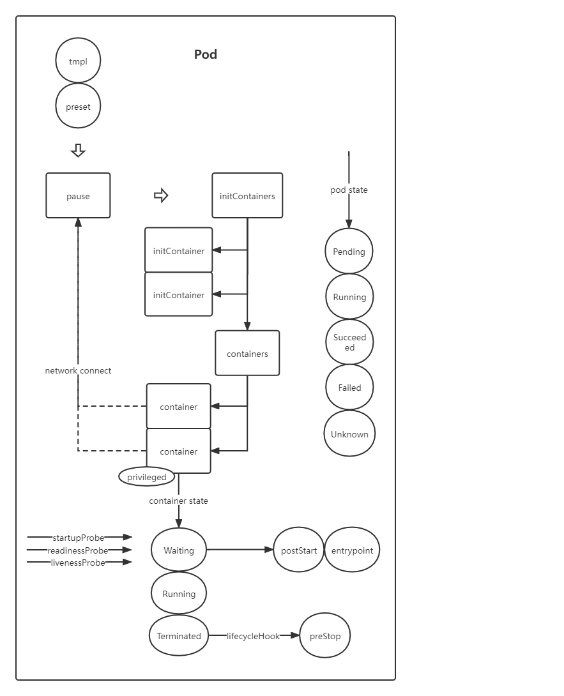

<!--
整理方式：
1、概括目标是什么
2、概括目标特点
3、绘制知识全景图
4、绘制问题画像图
-->

<!-- 你如何理解 pod ? -->
pod 是 k8s 中可以创建和部署的最小单位。相比于容器应用来说，pod 更像是逻辑主机，它内部包含了多个"逻辑应用"，这些应用共同聚合成了一个完整的服务。

其特点是：
* pod 内部可以拥有多个容器。
* pod 内部容器可以共享网络和存储。
* 从设计上看 pod 是相对临时性的，用后即删。

知识全景图  


问题画像图


### 如何实现网络互通
容器之间的相互访问存在一定局限性，或者说容器天然带有隔离性。
为了实现容器之间的相互访问，我们可以：    
>1、将容器部署到同一个命名空间下，通过容器之间的别名 alias 实现相互访问，也就是 docker-compose 中使用的方式。  
>2、采用网络连接的方式打通各个容器的网络。


## pod 示例
```yaml
apiVersion: v1
kind: Pod
metadata:
  labels:
    app: nginx
  name: liveness-http
spec:
  volumes:
  - name: host-time
    hostPath:
      path: /etc/localtime
      type: ""
  - name: empty-volume
    emptyDir: {}
  initContainers:
  - name: nginx-pre
    image: nginx
    command: ["echo", "pass"]
  containers:
  - name: nginx
    image: nginx
    securityContext.privileged: true
    livenessProbe:
      httpGet:
        path: /healthz
        port: 8080
        httpHeaders:
        - name: X-Custom-Header
          value: Awesome
      initialDelaySeconds: 15
      timeoutSeconds: 1
```


 
