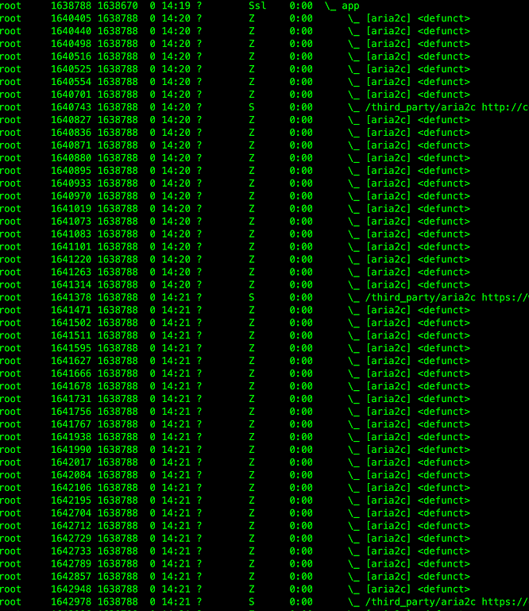

一个稳定跑了一年多的项目，近期突然被运维告知存在进程泄漏，带着懵逼的心情开始了排查...

<!--truncate-->

## 僵尸进程拖垮服务器
首先来看下运维提供的截图（屏蔽了部分敏感信息）：   
**1、大面积僵尸进程（进程状态 Z）**  
  

**2、统计进程数近30w**  
  

并且僵尸进程持续增长，最终拖垮服务器。

:::note 僵尸进程
一个进程的退出，需要被它的父进程或者相关联的进程接收，否则会一直阻塞，成为僵尸进程。

常见的僵尸进程产生场景有：   
1、父进程还在执行，子进程退出了，此时子进程的退出没有被父进程接收到，导致当前进程成为僵尸进程。    
2、子进程还在执行，父进程退出了，此时子进程的退出无法被其他进程接收，导致成为孤儿进程，也是僵尸进程的一种。     

僵尸进程状态为：Z  
以 `<defunct>` 标记指明    
:::

## 代码分析
```golang title="调用 cmd 模块"
ctxTimeout, cancel := context.WithDeadline(ctx, cfg.ExpiredAt)
defer cancel()
cmd := exec.CommandContext(ctxTimeout, "/third_party/aria2c", args...)
```
在上述代码能够看到，调用 `cmd` 时传入了 `ctxTimeout`，并且函数栈退出时调用了 `cancel`。  
看到这里，我们可以大致确认，`cmd` 最终肯定是可以退出的。但是就是这么一段简单的代码，仍然发生了进程泄漏。

我们需要注意的是，cmd 是 golang 的基础包，其启动方式有两种，如下：
```golang title="cmd 启动方法"
{
    cmd.Start()
    cmd.Wait()
}
{
    cmd.Run()  // 等价于 start + wait
}
```

继续往下排查：
```golang
ctxTimeout, cancel := context.WithDeadline(ctx, cfg.ExpiredAt)
defer cancel()
cmd := exec.CommandContext(ctxTimeout, "/third_party/aria2c", args...)

path, err := consumeOutput(cmd, ctxTimeout, cfg)
if err != nil {
    retrun err
}
```
`consumeOutput` 函数中涉及到一些日志输出的读取与分析，这里就不具体展示了，但这个函数的**最后一行调用了** `cmd.Wait()`。   
看到这里，问题的起因就大致有点眉目了。

我们来看下 `cmd.Wait()` 的文档，最后一行写着：
```text
Wait releases any resources associated with the Cmd.
```
所以可以初步判定，就是因为该函数调用过程中出现异常，没有执行 `cmd.Wait()` 函数就直接退出，导致 cmd 相关的子进程资源没有及时释放，从而造成线上大量僵尸进程。

## 解决方法
老项目，怎么简单怎来。  
这个问题说到底，还是 `cmd` 模块的使用方法不正确导致的，项目能稳定运行一年多，也只能归结于运气好...

直接在 `consumeOutput` 函数调用后主动加上 `cmd.Wait()` 就行了，虽然不优雅，但能解决问题。

<br/>

:::info 👇👇👇
**本文作者:** Czasg     
**版权声明:** 转载请注明出处哦~👮‍    
:::
