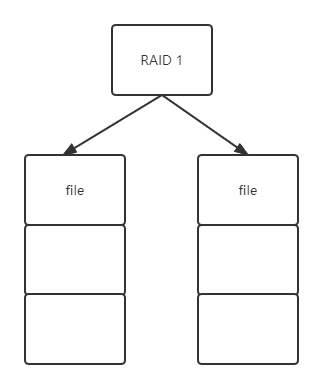
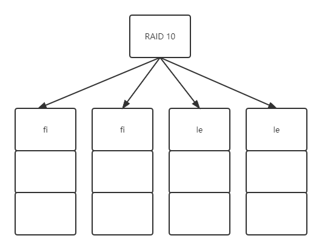

独立磁盘冗余阵列 RAID（redundant array of independent disks）技术   
是将多块磁盘通过某种协议管理起来，使其共同对外提供服务，从而提升性能。

常见 RAID 有五种：RAID 0、RAID 1、RAID 10、RAID 5、RAID 6。

<!--truncate-->

## RAID 0
RAID 0 是将一个文件的数据分成 N 片，同时向 N 个磁盘写入，这样单个文件就可以存储在 N 个磁盘上。   
理论上通过 RAID 0，单文件容量可以提升 N 倍，读写速度也可以提升 N 倍。    
但是 RAID 0 可能提升文件损坏的风险，因为任何一个磁盘损坏，都将导致数据不完整。    

## RAID 1
RAID 1 是同时往两块磁盘上写数据，其中一块用户数据备份。这样只要不是磁盘全部损坏，那么文件数据就不会丢失，文件的可用性大大提升。   
但是可用的存储空间就降低一半了。而且由于多写了一份数据，写入性能也变相的降低了。      

## RAID 10
RAID 10 是结合了 RAID 1 和 RAID 0，将多块硬盘进行两两分组。文件数据被分成了 N 份，每个组写入一份，并且每个分组的数据都有一份备份。    
这样不仅提升了文件存储的容量和性能，也提高了文件的可用性。     
但不可避免的和 RAID 1 一样，磁盘整体存储利用只有 50% 了。      

## RAID 5
RAID 5 针对 RAID 1 和 RAID 10 中磁盘浪费的情况进行了优化。   
将数据分成 N - 1 份，再利用这 N - 1 份数据进行位运算，计算一片校验数据，然后将这 N 片数据写入 N 个磁盘中。   
这样任何一个磁盘损坏，都可以利用校验数据进行恢复，磁盘利用率也提高到 (N-1)/N  

虽然 RAID 5 可以解决一块磁盘损坏后修复的场景，但是两块磁盘损坏，就仍然会出现数据丢失的情况。   

实践过程中，使用最多的还是 RAID 5.

## RAID 6
针对 RAID 5 中可能出现的两块磁盘损坏的场景，引入了两种位运算计算和存储数据，这样即使两块磁盘损坏，仍然是可以得到修复的。

 

:::info 👇👇👇
**本文作者:** Czasg     
**版权声明:** 转载请注明出处哦~👮‍    
:::
