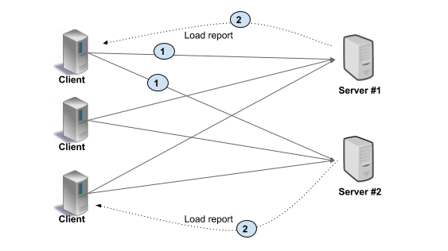

<!-- 参考自 https://www.lixueduan.com/post/grpc/13-loadbalance-on-k8s/ -->

本文主要介绍在 k8s 环境下 gRPC 服务在实现负载均衡时遇到的问题和解决思路。

<!--truncate-->

## 概述
我们的 gRPC 服务最初使用 `DaemonSet` 类型的资源对象部署在 k8s 上，通过节点亲和属性 `nodeAffinity`，使得单台宿主机仅运行这一个 `Pod`，然后通过 `NodePort Service` 的方式对外暴露服务。

在这种场景下直接对外暴露 IP 提供服务，业务流量全部打到单台宿主机上，所以也不存在负载均衡的说法。

随着业务压力逐渐增大，单点提供的能力已逐渐达到极限，我们采用水平拓展的方式，部署了多台单节点服务。也算暂时抗住了压力。但随后的暴露的问题，也让我们被迫选择了重构。

:::note 为什么选择重构
业务持续拓展，引入多节点的问题也逐渐暴露出来，当前服务架构下，多节点之间的数据一致性完全不能保证，人工运维简直不要太恶心，无奈只能重构。这里我们不针对此展开。  
:::

服务改造升级完毕后，完全兼容历史 gRPC 接口，在 k8s 的配置上也有部分改动，以前的 `DaemontSet` 类型变更为 `Deployment` 类型，而 `NodePort Service` 类型则变更为 `ClusterIP Service` 类型。
项目正式进入到了提测阶段。

功能上基本没有太大的问题，毕竟引用了相同的 gRPC 标准。

问题主要出现在了负载均衡上，在多副本的场景下，发生了严重的流量倾斜，具体表现就是某个副本的压力非常高，而其他副本的压力很小，进而导致服务整体异常。

:::tip 简单分析
gRPC 是基于 HTTP2.0 实现的长连接，且默认没有超时，这种长连接能够大量减少 TCP 连接管理所带来的开销，但也破坏了标准的连接级的负载均衡。因为连接已经建立且不断开，也无法再进一步负载均衡了。  

那么再回到上述场景，显然就是客户端与某个具体的服务建立了长连接，而连接又不会断开，从而导致了持续的流量倾斜问题。
:::

选择有效的 gRPC 负载均衡方案，是解决我们当前问题的核心。

具体解决的方法有多种，我们主要将其分为：  
* 用户侧的负载均衡
* 服务侧的负载均衡

## gRPC 负载均衡 - 用户侧
在用户侧的负载均衡中，用户根据配置解析出全部的 gRPC 服务，并为每一个服务都建立一次连接，然后由用户自己控制在各服务之间循环，实现负载均衡。

用户侧的方案可以很好的解决 gRPC 的负载均衡问题，且实施起来比较容易。但是当前方案无法感知新创建的服务。

## gRPC 负载均衡 - 服务侧
在服务侧的负载均衡中，引入一个负载均衡代理，我们称之为 `Load Balancer`，用户向 LB 发起 RPC 请求，然后由该 LB 将 RPC 分配到一个可用的后端服务器上，
由该服务器提供 gRPC 服务，并将负载情况报告给 LB，进一步补全 LB 的负载信息。

服务侧的方案中，负载由 LB 统一管理，可以很好的处理服务新增和删除的场景。但是实施难度较大。

## RR && DNS && MaxConnectionAge
该方案基于用户侧实现负载均衡。

## KubeResolver
该方案基于用户侧实现负载均衡。

 

:::info 👇👇👇
**本文作者:** Czasg     
**版权声明:** 转载请注明出处哦~👮‍    
:::
