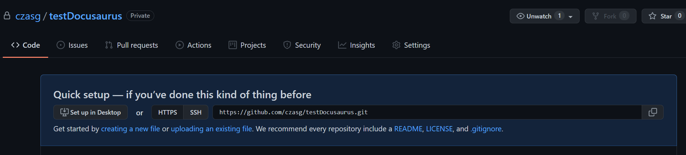
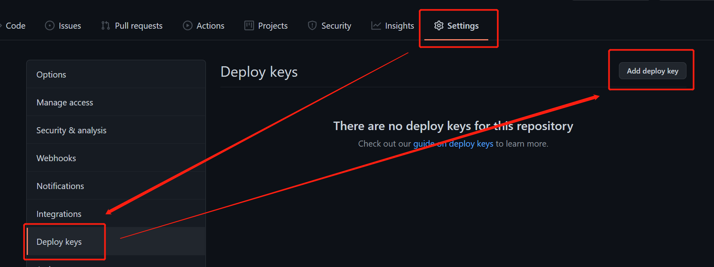

<!--truncate-->

## 1、新建 Github 仓库
首先，登录[Github仓库创建页面](https://github.com/new)，我们创建一个全新的空白仓库，项目名命名为 `testDocusaurus`。

然后通过 `git` 将仓库拉取到本地，至此，我们拥有了一个全新的空白仓库 `testDocusaurus`。  



## 2、初始化 Docusaurus 项目
> [Docusaurus项目初始化细节请参考官方文档](https://docusaurus.io/zh-CN/docs/installation)

进入到仓库 `testDocusaurus` 所在的空白目录，并在此目录打开终端界面。

为了更好的完成接下来的步骤，你可能需要预先安装**nodejs**。在此，假设你已经准备完毕。  
那我们接下来通过以下指令初始化一个 `Docusaurus` 项目。
```shell script
>>> npx create-docusaurus@latest website classic
...
...
Successfully created "website".
Inside that directory, you can run several commands:

  npm start
    Starts the development server.

  npm run build
    Bundles your website into static files for production.

  npm run serve
    Serves the built website locally.

  npm deploy
    Publishes the website to GitHub pages.

We recommend that you begin by typing:

  cd website
  npm start

Happy building awesome websites!
```

该指令运行完后，会输出一些简单的运行指令，而且我们应该可以看到一个 `website` 的目录，我们先将里面的内容剪贴出来，放到我们空白仓库目录下面。

此时，我们按照提示，运行 `npm start` 指令，我们就可以运行此项目。

通常启动端口为3000，则默认路径为：http://localhost:3000/  


## 3、搭建 Github Actions
> Github Actions部署细节参考[官方文档](https://docusaurus.io/zh-CN/docs/deployment#deploying-to-github-pages)

接入 `Github Actions` 需要创建一对新的 **SSH Key**，并将公钥和密钥均配置到 Github，我们来具体看下操作。

首先创建密钥，我们可以指定一个新的目录，然后得到公钥（id_rsa.pub）和私钥（id_rsa）
```shell script
>>> ssh-keygen -t rsa -C "email"
...
...
The key's randomart image is:
+---[RSA 3072]----+
| .=oo*=o=o.      |
| o+.=o==.o       |
|  .O.O=+o        |
|  ..=o@.oo       |
| . o +.+S+..     |
|  . + . E.o      |
|   o . .         |
|  .              |
|                 |
+----[SHA256]-----+
```

我们打开仓库的 `deploy keys`，选择新增，将 `id_rsa.pub` 中的内容复制进去，并选中 `Allow write access` 框，表示赋予部署写权限。


此时部署公钥已经完成，我们再将私钥也配置上。打开同级配置下的 Secret，选择新增密钥，
我们将私钥内容复制到 `Value` 中，而 `Name` 填写 `GH_PAGES_DEPLOY` 即可。

最后，我们创建 `Github Actions`，将模板复制进去，则整个流水线就已经配置好了。复制时，将对应的基础配置改下即可，如下：
```shell script
git config --global user.email "email"
git config --global user.name "name"
```
这里的 `email` 需要是 github 配置的 email，而 `name` 则是 github 用户名。

## 4、更新仓库，尝试自动部署

确保 Github Pages 已经初始化好，那么我们往仓库推送修改时，就可以触发自动部署了。
