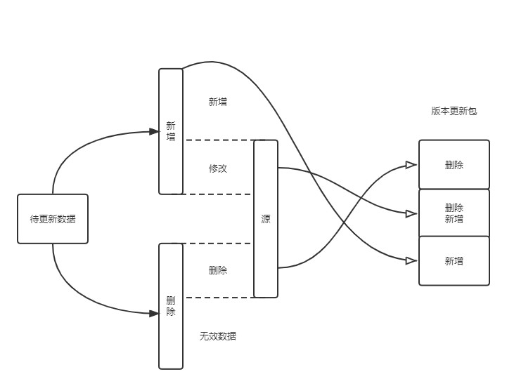

在常规数据库中，单表数据量到达百万时，查询方面就可能出现性能问题。而当单表数据量达到千万量级时，不仅查询，连索引维护也可能出现问题。     
此次我们的主角是"单表量级十亿"，本文章主要记录在优化期间的一些思路与实现。


<!--truncate-->

## 背景介绍
* **数据库**：postgres  
* **数据库配置**：4c8g + ssd
* **表名**：czasg（已脱敏）
* **表量级**：10亿  
* **表字段**：（已脱敏）
    * **key**：主键，类型 text
    * **value**： 类型 text
* **业务需求**：每天会有一批数据源，400w 左右，需求就是写入这批数据，并输出实际新增和更新的数据。

当前线上处理方式比较常规，主要包括下面两个步骤：

#### 1、创建临时表，写入数据
创建临时表，存储业务待处理数据，总量在 400w 上下。（数据插入过程略）
```sql
CREATE TEMPORARY TABLE tmp_czasg (
    key    text,
    value  text
) ON COMMIT DROP;
```

创建临时表，用于存储最终更新数据。
```sql
CREATE TEMPORARY TABLE tmp_czasg_update (
    key        text,
    value      text,
    old_value  text
) ON COMMIT DROP;
```


#### 2、join 计算结果集
以 key 为连接条件 join 原表，再过滤出 value 不同或者原表 value 为空的数据.
```sql
INSERT INTO tmp_czasg_update 
SELECT newkv.key, newkv.value, kv.value FROM tmp_czasg AS newkv 
LEFT JOIN czasg AS kv ON newkv.key = kv.key 
WHERE newkv.value != kv.value OR kv.value IS NULL;
```

#### 3、将结果集更新至表 `czasg`

`tmp_czasg_update` 中 old_value 为空的表示新增数据，我们将它插入到原表中。
```sql
INSERT INTO czasg SELECT key, value FROM tmp_czasg_update 
WHERE old_value IS NULL;
```

`tmp_czasg_update` 中 old_value 非空的表示更新数据，我们将它更新到原表中。
```sql
UPDATE czasg AS kv SET kv.value = newkv.value FROM 
(SELECT * FROM tmp_czasg_update WHERE old_value IS NOT NULL) AS newkv 
WHERE kv.key = newkv.key;
```

至此业务结束。根据当前线上情况，执行完一次需要 N（N >= 2）小时。

优化需求：由于该业务会长时间阻塞，影响其他关联业务，**希望减少此阶段的执行时间。**


## 优化之路：痛点分析
看完上面的背景介绍后，我们应该已经初步了解业务流程了，整理如下图：  



可以看出，主要涉及到的操作就是对数据表更新并生成版本更新包。

现在我们来拆解其中的流程，大致分析下耗时的原因：

1、创建临时表  
2、数据写入临时表  
3、**关联计算最终待作业的数据**    
4、**插入新数据**    
5、更新旧数据   
6、导出结果集   

在上述流程中，主要耗时点就是步骤 3 和 4。     
步骤 3 耗时是因为数据量过大，关联过程无法全程在内存中操作，需要借用磁盘来完成中间计算。               
步骤 4 耗时是因为存在索引，对这个量级的索引进行增删操作都会非常耗时。     

首先，针对量级过大的问题，解决方案比较统一，那就是进行水平拆分，尽可能减小表的大小。   
其次，针对索引导致的插入/删除耗时，解决方案也比较简单，就是插入/删除前，先 `DROP INDEX`，执行完操作后，再 `CREATE INDEX`。     
在这里我们之所以不这样做，是因为重建一张 10亿 量级表的索引，不见得比当前方案快多少。     

有了大致思路，我们再来想想具体的落地方案。


## 优化之路：表分区
针对第一个问题，我们计划选择水平拆分这张大表。    
拆分时要考虑到单表的大小，最好能控制在百万级。    
所以我们可以选择将这张 10亿 大表拆分成 256 张小表，这样平均到每张表的大小就是 400w 左右了。

一般拆分的方式就是创建多张物理表，然后将数据按照某种规则均匀的插入到这些表中，从而减小单表的大小。  
但我们业务场景并没有特别复杂，在这里我们选择了**表分区**。

自然而然，`key` 字段也就成了我们首选的分区条件。  
由于该字段是随机字串，没有规律，只能采用哈希的方式散射到各个分区。  
然后我在分区内创建 `key_btree_index_key` 索引，此时每个分区的索引大小就可以控制在较小的范围内了。  

到这里，初步优化方案已经形成。但考虑到随机字串生成的索引，无论在空间还是性能上都有所欠缺，
所以本着一步优化到位的想法，我们决定重新设计字段索引：  
1、新增一个字段 `key_crc32`，用于存储 `key` 值计算出的哈希数，此数位于 `1 ~ 2^32` 之间。    
2、将分区条件设定为 `key_crc32`     
3、创建分区索引 `key_crc32_btree_index_key`     

至此，我们的表分区方案初步落地。索引这一块属于过度设计，因为引入了新字段，所以是否属于正向优化，有待考量。


<!-- http://www.postgres.cn/docs/12/ddl-inherit.html -->
:::tip 表继承
在 postgres 中，继承可以快速的**关联、区分**多张表，让数据维护更加高效。  

使用继承时，至少需要有一张源表，然后通过指定源表来创建继承表。    
对于继承表来说，此时的继承表将**拥有源表的全部列**，并且可以自定义额外的列属性。       
对于源表来说，此时的源表将可以检索**自身以及继承表的全部数据**。   

在这里我们举一个例子，假设你有一张表 `cities`，里面存放了国内外所有的城市。
```sql
CREATE TABLE cities (
    name      text,   -- 城市名
    altitude  int     -- 城市海拔高度
);
```
可是每个国家只有一个首都城市，现在有业务需求要快速筛分首都城市。  
为了实现这个需求，我们可能需要给这张表加一个字段，或者重新创建一张首都城市的表，这些都是不错的实现方案。  
现在，让我们用继承来实现这个需求：
```sql
CREATE TABLE capitals (
    country  text     -- 所属国
) INHERITS (cities);
```
在这里我们创建继承表 `capitals`，继承自 `cities`。这时我们可以这样存储数据：  
1、将首都城市存放至 `capitals`，并指定所属国。  
2、将其余城市存放至 `cities`。   
```sql title="查询所有城市中，海拔高于500的城市"
SELECT * FROM cities WHERE altitude > 500;
```
```sql title="查询非首都城市中，海拔高于500的城市"
SELECT * FROM ONLY cities WHERE altitude > 500; -- 通过 ONLY 限制仅查 cities 表
```
```sql title="查询所有首都城市中，海拔高于500的城市"
SELECT * FROM capitals WHERE altitude > 500;
```
:::

<!-- http://www.postgres.cn/docs/12/ddl-partitioning.html -->
:::tip 表分区
在 postgres 中，表分区是将一张大表，划分成一些小的物理上的片。这样划分的好处有很多：  
* 某些场景下读写性能提升。**减小单表数据量、索引大小**。      
* 某些场景下，**批量操作**性能将得到极大提升。     
* 可以按实际需求，将价值低的数据块迁移至便宜且较慢的存储介质上。   

创建表分区的方式有两种：    
第一种，初始化时通过 `PARTITION BY` 声明该表为分区表，且需要指定分区键，然后就可以创建分区了。
```sql title="声明分区表"
CREATE TABLE measurement (
    city_id    int not null,
    logdate    date not null,
    peaktemp   int,
    unitsales  int
) PARTITION BY RANGE (logdate); -- 分区支持范围划分、列表划分、哈希划分
```
```sql title="创建分区"
CREATE TABLE measurement_y2006m02 PARTITION OF measurement
    FOR VALUES FROM ('2006-02-01') TO ('2006-03-01');
CREATE TABLE measurement_y2006m03 PARTITION OF measurement
    FOR VALUES FROM ('2006-03-01') TO ('2006-04-01');
```
创建分区之后，你对 `measurement` 的操作都会被重定向到某个分区，比如：  
1、插入一条数据到 `measurement` 中，当这条数据被**映射到 `measurement_y2006m02` 时**，
这条数据将被**重定向**到 `measurement_y2006m02` 分区。  
2、读取一条数据，当这条数据被映射到 `measurement_y2006m02` 时，查询也会重定向。

第二种，通过继承实现表分区。
```sql title="创建继承表"
CREATE TABLE measurement_y2006m02 () INHERITS (measurement);
```
为了实现类似分区表的能力，我们引入触发器：
```sql title="创建触发器与函数"
CREATE OR REPLACE FUNCTION measurement_insert_trigger()
RETURNS TRIGGER AS $$
BEGIN
    INSERT INTO measurement_y2008m01 VALUES (NEW.*);
    RETURN NULL;
END;
$$
LANGUAGE plpgsql;

CREATE TRIGGER insert_measurement_trigger
    BEFORE INSERT ON measurement
    FOR EACH ROW EXECUTE FUNCTION measurement_insert_trigger();
```
我们可以看到通过继承与触发器的方式，我们可以间接实现分区表的能力，他相比于声明式分区表，优势就是限制会宽松一些，
比如我们可以为每一个分区创建不同的字段的不同索引，但代价就是更复杂维护逻辑。
:::


## 优化之路：继承式分区表填坑
按照预期方案实现后，我拷贝了一份正式环境数据执行测试，结果令人震惊，耗时 3小时 😱😱😱       
就离了个大谱，妥妥的反向优化。 😭😭😭  

理论和实际差距过大，不得不让我开始反思到底是哪里出现了异常。   
通过日志发现在关联计算、插入新数据、更新数据这些流程都非常耗时。  
但是我们已经设计了分区，减小了每张表的数量和索引大小。所以理论上操作不可能会更耗时。  

通过进一步打断点输出日志，我发现了继承式分区表的触发器，在执行操作时性能非常拉跨。
```sql title="初始化表分区"
CREATE TABLE IF NOT EXISTS origin_0 (CHECK (origin_id = 0)) INHERITS (cloud_search_kvs);
CREATE TABLE IF NOT EXISTS origin_0_0 (CHECK (0 < k_crc32 AND k_crc32 <= 858993459)) INHERITS (origin_0);
CREATE TABLE IF NOT EXISTS origin_0_1 (CHECK (858993459 < k_crc32 AND k_crc32 <= 1717986918)) INHERITS (origin_0);
CREATE TABLE IF NOT EXISTS origin_0_2 (CHECK (1717986918 < k_crc32 AND k_crc32 <= 2576980377)) INHERITS (origin_0);
CREATE TABLE IF NOT EXISTS origin_0_3 (CHECK (2576980377 < k_crc32 AND k_crc32 <= 3435973836)) INHERITS (origin_0);
CREATE TABLE IF NOT EXISTS origin_0_4 (CHECK (3435973836 < k_crc32 AND k_crc32 <= 4294967295)) INHERITS (origin_0);
```
```sql title="初始化触发器"
CREATE OR REPLACE FUNCTION origin_0_insert_trigger() RETURNS TRIGGER AS $$
BEGIN
 IF (0 < NEW.k_crc32 AND NEW.k_crc32 <= 858993459) THEN INSERT INTO origin_0_0 VALUES (NEW.*);
 ELSIF (858993459 < NEW.k_crc32 AND NEW.k_crc32 <= 1717986918) THEN INSERT INTO origin_0_1 VALUES (NEW.*);
 ELSIF (1717986918 < NEW.k_crc32 AND NEW.k_crc32 <= 2576980377) THEN INSERT INTO origin_0_2 VALUES (NEW.*);
 ELSIF (2576980377 < NEW.k_crc32 AND NEW.k_crc32 <= 3435973836) THEN INSERT INTO origin_0_3 VALUES (NEW.*);
 ELSIF (3435973836 < NEW.k_crc32 AND NEW.k_crc32 <= 4294967295) THEN INSERT INTO origin_0_4 VALUES (NEW.*);
 END IF;
 RETURN NULL;
END;
$$ LANGUAGE plpgsql;
```
触发器的原理就是通过查询条件，将数据重定向到指定分区。  
上面的初始化语句都是简化后的，实际上有 256 个判断条件，而且触发器每次似乎只能执行单条语句，这也导致了整体性能急剧下降。   
我们方案设计上没有太大的问题，但是执行方式有问题，触发器的重定向不适合这种场景，所以我只能尝试自己维护。

重新优化思路，获取每个分区的数据，直接和目标分区作关联运算，绕开触发器。  
```sql
CREATE TEMPORARY TABLE temp_diff_%[2]d (
    k text,
    v text,
	k_crc32 bigint,
    old_v text
) ON COMMIT DROP;
WITH temp_diff_w AS (SELECT * FROM temp_add WHERE (%[3]d < k_crc32 AND k_crc32 <= %[4]d))
INSERT INTO temp_diff_%[2]d SELECT tadd.k, tadd.v, tadd.k_crc32, tadd.origin_id, kv.v FROM temp_diff_w AS tadd LEFT JOIN origin AS kv ON tadd.k = kv.k AND tadd.k_crc32 = kv.k_crc32 WHERE tadd.v != kv.v OR kv.v IS NULL;
INSERT INTO temp_diff (SELECT * FROM temp_diff;
UPDATE origin AS o SET v = row.v FROM (SELECT * FROM temp_diff_%[2]d WHERE old_v IS NOT NULL) as row WHERE o.k_crc32 = row.k_crc32 AND o.k = row.k;
DROP INDEX IF EXISTS origin_btree_index_key;
INSERT INTO origin (k, v, k_crc32, origin_id) (SELECT k, v, k_crc32, origin_id FROM temp_diff_%[2]d WHERE old_v IS NULL);
CREATE INDEX IF NOT EXISTS origin_btree_index_key ON origin USING btree (k_crc32);
DROP TABLE IF EXISTS temp_diff_%[2]d;
```
以上是部分执行语句（已脱敏），可以看出，第一步就取出了分区数据，然后执行关联运算获取最终结果集，再将结果集数据写入源表即可。  

再次测试，执行一次大概在 半小时 左右，完美 🤠🤠🤠


<br/>

:::info 👇👇👇
**本文作者:** Czasg        
**版权声明:** 转载请注明出处哦~👮‍
:::
