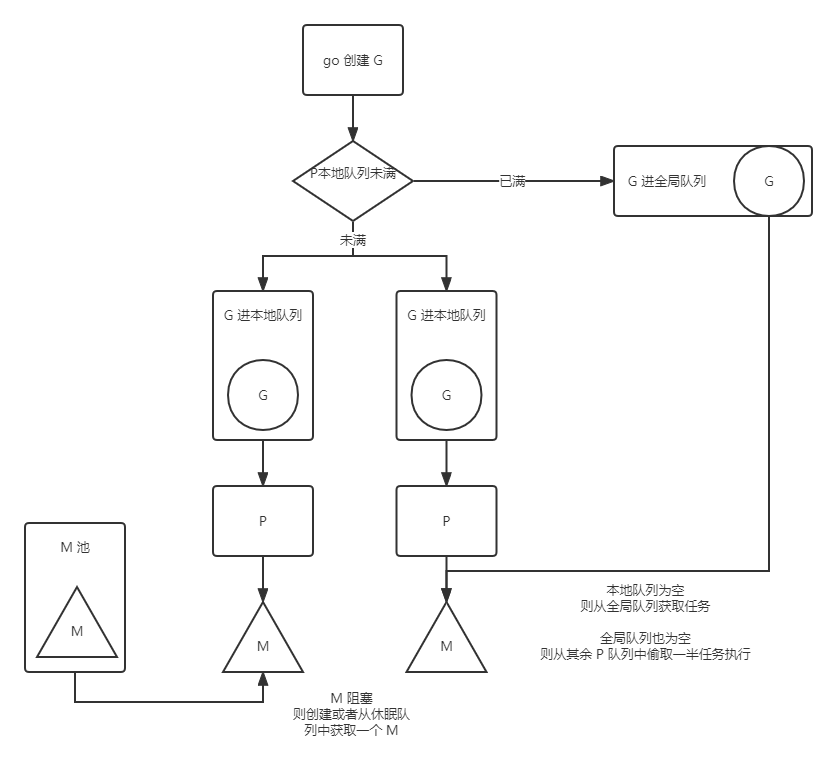

<!-- https://zhuanlan.zhihu.com/p/261590663 -->

<!--truncate-->

## CSP
CSP（communicating sequential processes），是 golang 推崇的一种并发模式，其中有一句比较经典的话是：    
**不要以共享内存的方式来通信，相反，应该以通信的方式来共享内存。**

在常见的多线程共享内存的模式中，当涉及到多线程操作共享数据时，一般需要通过加锁来保证数据和线程安全。  
go 则引入了 chan 信道，可以用于多 goroutine 之间的通信。

## GMP
golang 执行多任务时，会创建多个线程，然后有调度器会将任务单元分配给线程执行，这种方式是一种典型的生产者消费者模式。

* G：goroutine，此处指协程。它相当于操作系统的进程控制块，包含：寄存器、线程上下文、函数执行指令等。     
* M：machine，此处指实际的内核线程，用于执行 G。    
* P：processor，此处指调度器，是 M 所需要的上下文环境，内部维护有一个本地队列。当 P 中有任务时，会创建或者唤醒 M 去处理任务。   
* 本地队列：P 维护一个本地队列来存放 G，新创建的 G 会优先存放在 P 的本地队列，当本地队列满后，会放入到全局队列。    
* 全局队列：M 执行时会先从本地队列获取 G，本地没有则去全局队列获取，如果全局队列也没有，则尝试去其他 P 的本地队列去偷取一些任务。   
* M0：程序启动后第一个线程，负责启动起一个 G0 并执行初始化操作，包含初始化本地队列、全局队列等，启动 G0 之后 M0 就和普通 M 一样了。
* G0：每创建一个 M，都会创建一个 G0，这里的 G0 仅用于负责调度其他的 G。比如当 M 从 G1 切换至 G2，首先应该切到 G0，然后由 G0 干掉 G1，再把 G2 加载进来。

  
1、go 创建 G。   
2、将 G 保存在本地队列，若本地队列满了，则保存到全局队列。    
3、P 与 M 绑定，M 执行本地队列任务 G，若本地队列任务执行完成，则从全局队列获取任务，若全局队列也没有，则从其他 P 的本地队列中偷取一半任务来执行。   
4、若 M 执行期间发生系统阻塞，此时 M 与 P 解绑，P 将申请创建新的 M 或者唤醒休眠的 M 重新绑定与执行。     
5、当 M 恢复时，会尝试获取一个空闲的 P，如果没有 P 空闲，M 则进入休眠，G 会放入到全局队列。  

#### go 初始化流程
1、创建 M0  
2、创建 G0  
3、绑定 M0 与 G0   
4、执行初始化操作  
5、M0 投入使用，尝试与空闲 P 绑定   


## 1.14 基于信号的抢占式调度
当有大量 G 任务，为了让每个任务都有时间运行，`runtime.main` 会创建一个额外的 M 来运行 `sysmon` 函数，来实现监控与抢占。
```go
func main() {
    runtime.GOMAXPROCS(1)
    go func() {
        fmt.Println("pass")
    }
    for {
    }
}
```
在 1.14 之前上面这段代码将不会输出任何结果，因为 main 会占用全部的计算资源。   


<br/>

:::info 👇👇👇
**本文作者:** Czasg    
**版权声明:** 转载请注明出处哦~👮‍
:::
