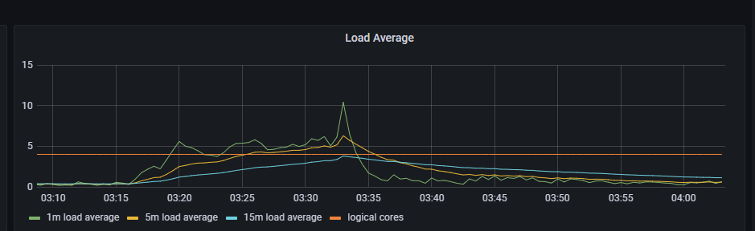

今天遇到一个诡异的事情，有一个基于 redis 提供高性能查询的服务，在非高峰期时居然大量报错。      
为什么说诡异呢，因为报错内容为：`redis: connection pool timeout`。而这个服务的查询场景及其简单，只有 `get` 和 `mget` 两种，报这个错就意味着 redis 查询性能不足？         
本文记录一下排查问题的过程。      


<!--truncate-->

## 第一轮分析定位
`redis: connection pool timeout` 是连接池超时，这种问题发生的场景一般是由于某个操作过于耗时，导致 redis 阻塞，从而导致其他查询报错。      
所以第一步就是去线上查看慢日志 `SLOWLOG`，我们慢日志阈值为 1s，而连接超时配置为 4s。如果是因为慢操作导致超时，那应该是会被记录下来的。  
但实际没有，因为我们业务场景只有简单的 `get` 和 小量的 `mget`。所以要从其他角度进行分析。

这个服务当时的并发压力在几千QPS左右，redis 不应该存在抗不住的问题。翻了下报错时间点的上下文日志，确实发现了一些问题：       
     
箭头时间段，即在42分到44分之间，刚好就是 redis 查询报错的时间段。     
说明就是42分的同步行为，影响到了 redis 的查询性能。   

通过排查发现，这个服务有点特殊，是以 daemon 的形式部署在 k8s 上，且单 pod 独占节点。pod 内又包含 redis 和 postgres 等多个服务。      
进一步排查了解到，因为资源有限，所以没加资源配额，避免服务部署不上去。因此，存在某时刻的**资源倾斜**导致其余服务不可用。
      
这类问题其实在物理机上经常发生，没想到这次换了种形式发生在了 k8s 上面。    
解决方法也比较简单：    
1、增加机器资源，建议 4c 升级 8c。     
2、增加资源配额。 

由于预算不足，暂时只能采用第二种方案，即加上资源配额。    
但是资源实在有限，无法具体精确到每一个容器，故暂时仅对 redis 加上资源配额：  
```yaml
resources:
  requests:
    cpu: '1'
```

## 第二轮分析定位
通过几天的观察，发现并没有实际的效果。redis 仍然出现了查询超时的场景。而且还是在更新高峰期时间段发生的。   
但是我们已经给 redis 单独申请了 1c 的计算资源，不应该出现类似问题。

我们仔细排查了容器监控，发现各个容器都没有出现明显的高负载场景。情况有点诡异，从内部看不出什么情况，所以我们看了下当前节点的监控：   
   
果然，cpu 利用率没有满，但是 Load 负载已经满了。甚至超了很多。  
基本可以石锤是 pg 在高更新场景影响 redis 调度。暂时只能增加 limits 资源限制了。

:::info load average - 平均负载
`load average` 是指单位时间内，系统处于 **可运行状态** 和 **不可终端状态** 的平均进程数，它和 cpu 使用率没有直接关系。

其中，可运行状态指正在使用 cpu 或者 正在等待 cpu 的进程，即处于 R 状态的进程。      
不可中断状态的进程，是指正处于内核态关键流程中的进程，并且这些进程是不可打断的。比如最常见的就是等待硬件设备的IO响应。    

所以，1m load average 的意思就是指 1min 内正在使用 cpu 的线程 + 正在等待 cpu 的线程 + 正在等待IO的线程。同理 5m 和 15 m 也是如此计算。

对于计算密集型任务，cpu 使用率升高时，平均负载基本也会升高。     
对于IO密集型任务，cpu 使用率可能不会很高，但由于等待IO的线程会增加，所以平均负载也会增加。         
:::


## 第三轮分析定位
突然想起官网的一句话：对于 redis 来说，cpu 往往不会是性能瓶颈，内存大小和网络带宽才可能是 redis 的瓶颈。

之前的分析应该是被带偏了。对于高更新场景，数据库会占用大量的磁盘IO，这一块可能会造成影响？


<br/>

:::info 👇👇👇
**本文作者:** Czasg
**版权声明:** 转载请注明出处哦~👮‍
:::