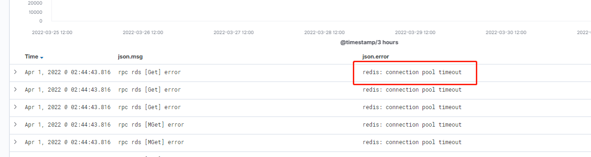
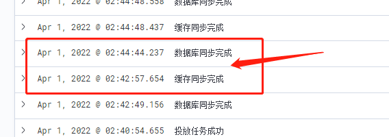

今天遇到一个诡异的事情，有一个基于 redis 提供高性能查询的服务，在非高峰期时居然大量报错。      
为什么说诡异呢，因为报错内容为：`redis: connection pool timeout`。而这个服务的查询场景及其简单，只有 `get` 和 `mget` 两种，报这个错就意味着 redis 查询性能不足？         
本文记录一下排查问题的过程。      

<!--truncate-->

## 错误分析
`redis: connection pool timeout` 是连接池超时，这种问题发生的场景一般是由于某个操作过于耗时，导致 redis 阻塞，从而导致其他查询报错。      
但在这个场景中，这种分析不适用，因为操作只有简单的 `get` 和 小量的 `mget`。      
具体问题需要进一步分析。

## 问题分析
这个服务当时的并发压力在 3w QPS左右，redis 不应该存在抗不住的问题。翻了下报错时间点的上下文日志，确实发现了一些问题：       
     
箭头时间段，即在42分到44分之间，刚好就是 redis 查询报错的时间段。     
说明就是42分的同步行为，影响到了 redis 的查询性能。   

通过排查发现，这个服务有点特殊，是以 daemon 的形式部署在 k8s 上，且单 pod 独占节点。pod 内又包含 redis 和 postgres 等多个服务。      
进一步排查了解到，因为资源有限，所以没加资源配额，避免服务部署不上去。因此，存在某时刻的**资源倾斜**导致其余服务不可用。
      
这类问题其实在物理机上经常发生，没想到这次换了种形式发生在了 k8s 上面。    

## 解决方案
1、增加机器资源，建议 4c 升级 8c。     
2、增加资源配额。   

 

:::info 👇👇👇
**本文作者:** Czasg
**版权声明:** 转载请注明出处哦~👮‍
:::