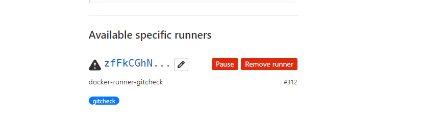

`gitlab-runner`实际运行时，会远程获取我们的代码仓，然后执行配置的`.gitlab-ci.yaml`文件，这个文件和`jenkinsfile`一个性质，里面定义了 CICD 的检测流程。

换句话说，`gitlab-runner`和我们的代码仓是完全解耦的。是可以部署在其他服务器上，并且可以部署多个的。

<!--truncate-->

## 1、创建 volume
首先需要为 `gitlab-runner` 创建一个公共配置存在路径，目的是为了共享配置。

可以是具体的文件路径，也可以使用 `docker volume create` 创建一个公共挂载，后续其他的 runner 都挂载此目录，即可实现共享配置。   
```shell script
docker volume create gitlab-runner-config
```

## 2、注册 runner
首先需要获取 gitlab 基础信息。    


然后注册 runner   
```shell script
docker run --rm -v gitlab-runner-config:/etc/gitlab-runner gitlab/gitlab-runner register \
  --non-interactive \
  --url "Gitlab 的 URL 复制过来" \
  --registration-token "Gitlab 的 Token 复制过来" \
  --executor "docker" \
  --docker-image "要运行的镜像，eg: python:3.6.8" \
  --description "docker-runner-test" \
  --tag-list "docker,test" \
  --run-untagged="true" \
  --locked="false" \
  --access-level="not_protected" \
  --docker-pull-policy="if-not-present"
```

注册完成后，在 gitlab 界面会出现你注册的 runner 信息。没有可以刷新看看，实在没有，应该是注册失败了。      
   

## 3、启动 runner
```shell script title="help帮助指令1"
docker run -it --name gitlab-runner --rm \
    -v /var/run/docker.sock:/var/run/docker.sock \
    -v gitlab-runner-config:/etc/gitlab-runner \
    gitlab/gitlab-runner:latest help
```

```shell script title="help帮助指令2"
docker run -it --name gitlab-runner --rm \
    -v /var/run/docker.sock:/var/run/docker.sock \
    -v gitlab-runner-config:/etc/gitlab-runner \
    gitlab/gitlab-runner:latest help unregister
```

```shell script title="list 列表查看runner"
docker run -it --name gitlab-runner --rm \
    -v /var/run/docker.sock:/var/run/docker.sock \
    -v gitlab-runner-config:/etc/gitlab-runner \
    gitlab/gitlab-runner:latest list
```

```shell script title="unregister 删除runner"
docker run -it --name gitlab-runner --rm \
    -v /var/run/docker.sock:/var/run/docker.sock \
    -v gitlab-runner-config:/etc/gitlab-runner \
    gitlab/gitlab-runner:latest unregister -t=GIRLAB_TOKEN
```


<br/>

:::info 👇👇👇
**本文作者:** Czasg    
**版权声明:** 转载请注明出处哦~👮‍
:::
