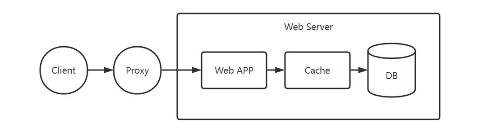
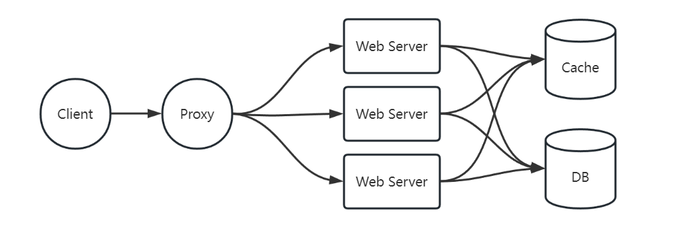
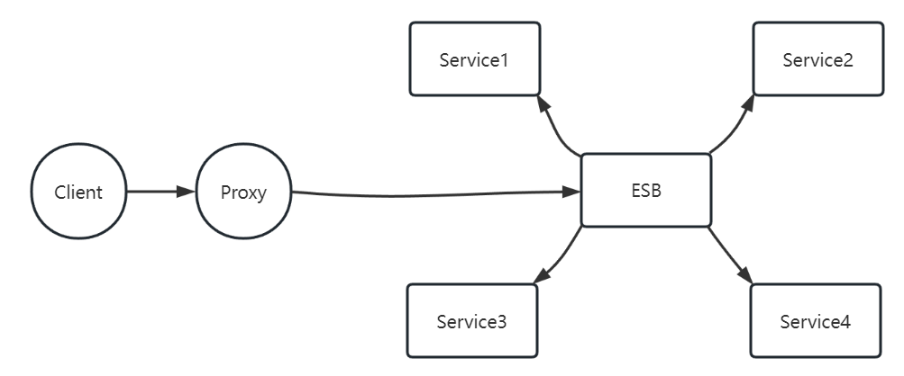
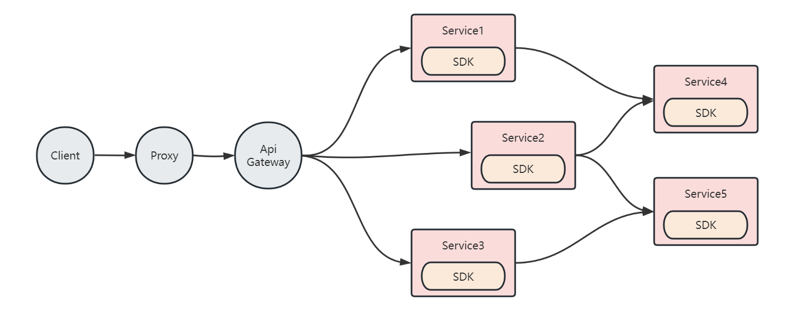
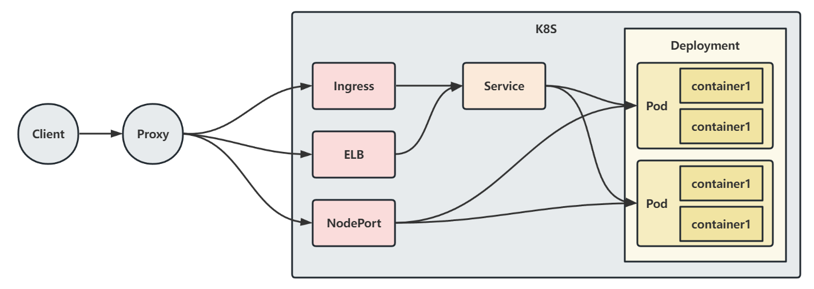
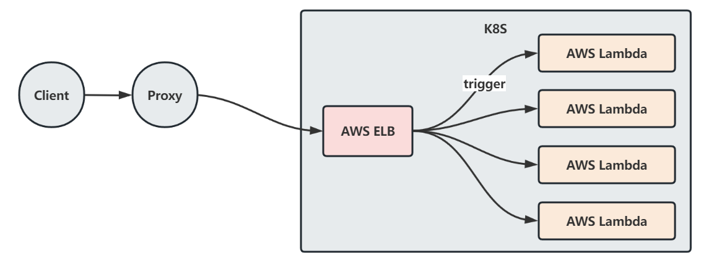

import Tabs from '@theme/Tabs';
import TabItem from '@theme/TabItem';

在现代 Web 开发中，技术框架与架构之间是相辅相成的关系，它们在后端开发中都扮演着至关重要的角色。
因此，学习框架在开发过程中的作用，了解架构的演进，是每位后端开发者都应该具备的重要知识。

通过本文，你可以学习并了解以下内容：

- 后端技术框架的重要性和作用
- 后端技术架构的发展趋势
- 常见后端技术框架
- 技术框架选择与评估
- 后端技术框架实践

<!--truncate-->


### 后端技术框架的重要性和作用
后端技术框架提供了一个结构化的框架，帮助开发人员构建高效、可靠和可扩展的后端应用程序。
这些框架简化了开发过程，提高了效率，促进了代码的组织和可维护性。

在后端技术框架中，最常见的核心模块之一是对 HTTP 请求处理的封装。一次完整的 HTTP 请求过程包括：

1. **接收请求**：框架通过网络监听和接收传入的 HTTP 请求。
2. **请求报文解析**：框架负责解析请求报文，提取出请求的方法、URL、请求头和请求体等信息。
3. **业务逻辑处理**：框架将请求路由到相应的处理程序或控制器，执行具体的业务逻辑，可能涉及数据库操作、外部服务调用等。
4. **响应报文构建**：在业务处理完成后，框架根据处理结果构建响应报文，包括设置响应状态码、响应头和响应体等内容。
5. **发送响应**：框架将构建好的响应报文发送回客户端，完成一次完整的请求-响应周期。


<Tabs>
<TabItem value="请求报文示例" label="请求报文示例" default>

```text
GET / HTTP/1.1
Content-Type: text/html
Content-Length: 8
Connection: keep-alive
Accept-Encoding: gzip, deflate, br
Accept-Language: zh-CN,zh;q=0.9,en;q=0.8

req body
```

</TabItem>
<TabItem value="响应报文示例" label="响应报文示例">

```text
HTTP/1.1 200 OK
Content-Type: text/html
Content-Length: 9
Connection: keep-alive
Content-Encoding: gzip
Date: Fri, 23 Jun 2023 14:00:49 GMT

resp body
```

</TabItem>
</Tabs>

除了对 HTTP 请求的支持之外，技术框架还可以提供对开发流程的规范约束和最佳实践。
框架能够简化技术人员对底层细节的处理，并提供开发过程中所需的工具、库和组件，以加速应用程序的开发。

我们可以总结出现代后端技术框架在web开发过程中发挥的作用：

- 加速开发，提高效率
- 抽象底层细节
- 标准化架构设计和模式
- 丰富的工具/组件库

### 后端技术架构的发展趋势

随着业务复杂度以及开发团队规模的不断扩大，后端技术架构呈现以下发展趋势：

- 单体架构
- 分布式架构
- 微服务架构
- 云原生架构
- 无服务器架构

让我们分别了解下每一个阶段架构的特点，以更好地理解它们的优势和适用场景。

#### 单体架构

单体架构是传统的应用架构模式，它将整个应用作为一个单一的、完整的系统进行开发和部署，具有简单、易于开发和测试的优点。

但随着业务的增长，可能面临扩展和维护的挑战。包括：
- **单点风险**：一旦应用服务异常，则可能导致整个服务异常
- **可扩展性有限**：单体架构在应对大规模和高并发的需求时存在单机瓶颈限制，难以实现水平扩展



为了解决以上问题，业界衍生出了分布式架构和多服务部署的方式。

#### 分布式架构

分布式架构将应用程序拆分为多个独立的模块，每个模块可以部署在不同的服务器或计算节点上。
通过分布式架构，可以实现系统的横向扩展和高可用性，并提供更好的性能和容错能力。

在分布式架构中，我们往往容易混淆它和多服务部署之间的关系。

:::info 如何理解分布式与多服务部署之间的关系
分布式架构是一种系统架构的设计模式，它通过将系统拆分为多个组件并分布在不同节点上来提高可扩展性和性能。

多服务部署，则是分布式架构中的一种实践方式，
它通过将应用拆分为多个微服务并在多个节点上进行部署来提高系统的可靠性和容错性。
:::

分布式架构虽然解决了单点故障与瓶颈问题，但随着业务的增长，可能面临系统复杂度提升的挑战。主要包括：

- **系统复杂性增加**：分布式架构中的各个组件和服务之间需要进行协同和管理，系统的复杂性增加。
- **异常定位困难**：分布式架构往往涉及多个组件和服务之间的协同工作。一旦出现异常，跨服务的工作模式可能会给问题定位增加难度。



因此，如何按照一定的业务边界划分系统功能模块，提高模块的可复用性和可维护性就显得很关键了。

#### 微服务架构

当我们有了按业务拆分应用模块的想法时，做出来的产品就具有了微服务的雏形了。

其实在微服务成为潮流之前，还有一个很热门的阶段，就是我们常说的面向服务的架构（Service-Oriented Architecture，简称SOA）。
因为它们都具有**拆**的思想，所以很多同学都往往容易混淆。

:::info 如何理解微服务架构与SOA架构之间的关系

面向服务的架构（Service-Oriented Architecture，简称SOA）是一种以服务为中心的架构模式，
它将应用程序划分为一系列独立的、可重用的服务组件。
这些服务通过标准化的接口和协议进行通信，实现松耦合和可组合的系统构建。

其中，有一个著名的实践方式就是企业服务总线架构（Enterprise Service Bus，简称ESB）。



ESB采用中心化的总线架构，将服务治理能力集成到中心的ESB中。在这种架构中，总线模块将变得及其臃肿，这也是一个弊端吧。

在SOA架构中，服务之间不够绝对的独立，因为它们总是通过ESB进行绑定。

对比微服务的话，可以把微服务简单理解为"去掉ESB的SOA"。
或者是另一种**更加独立的"拆法"**。

:::

微服务架构是一种基于分布式架构的设计模式，它将应用程序拆分为一组小型、独立的服务。
每个服务都可以独立开发、部署和扩展。其中，不同程序之间通过轻量级通信机制（SDK）进行互相协作。微服务架构具有高度可扩展性、灵活性和自治性的特点。



当然，微服务拆多了也是一场运维灾难。实际拆分场景应该综合考虑程序独立性、复用性和架构复杂度。

#### 云原生架构

随着容器化技术的兴起，云原生架构得到了广泛应用。

云原生架构是为云环境设计和构建的应用架构，利用云服务提供的**弹性、可扩展和自动化特性**。
它强调容器化部署、动态编排和自动化管理，以适应云环境的要求。

当前应用市场基本就是 K8S 全家桶了。




#### 无服务器架构

无服务器架构（Serverless Architecture）是一种以**事件驱动**和**函数计算**为核心的架构模式。
在无服务器架构中，开发人员可以编写独立的函数，由云平台自动管理函数的部署和资源分配，无需关心底层的服务器和基础设施。





### 常见后端技术框架

后端技术框架的生态圈是非常丰富的。此处仅列举部分有代表性的框架：

#### 极简主义

所谓极简主义，就是框架本身没有任何限制，它仅仅提供最基础的Web开发能力。开发人员可以自由实现项目架构与内容组织。

Flask 就是典型的极简主义框架。它是一个轻量级且易用的框架，适合作为入门框架。

但这并不意味着 Flask 就没有任何深度了。要想深入学习和进阶一个框架，也是一件不容易的事。
如果你不了解 Flask 的蓝图、钩子、线程本地数据等机制，那你可能还需要再研究研究。

#### 全能战士

能被称作"全能战士"的框架，一定都是市场占有度非常高的。而 Django 就是典型的"全能战士"框架。

相比于极简主义，Django 在设计上更加全面，它提供了更多的内置功能和约定，旨在为开发人员提供最大的开发效率和生产力。
它包含了诸多功能，例如对象关系映射（ORM）、认证和授权系统、管理界面、表单处理、缓存机制等等。
这些内置功能使得 Django 成为一个完整而强大的框架，适用于大型和复杂的Web应用程序的开发。

#### 微服务框架

看名字就知道是老潮流了。此处我们以 B 站开源的 Kratos 为例简单介绍下。

Kratos 是一款开源的微服务框架，由 Bilibili 开发并开源。
它是基于 Go 语言构建的，旨在帮助开发人员更轻松地构建高性能、可扩展的微服务应用程序。

相比于我们的"全能战士"，微服务框架还提供了微服务治理的能力。
包括我们常说的服务注册与发现、负载均衡、熔断器等，这些可以帮助开发人员更好地管理和监控微服务应用。


### 技术框架选择与评估

那么有这么多技术框架，我们如何选择和评估最合适的技术框架呢？

通常情况下，建议团队使用已有的技术框架。

引入新的技术不仅有一定的学习成本，再某些时候甚至会引入风险。因为"前沿"技术并不一定是"稳定"的。

如果确实需要重新选择技术框架，应优先考虑从业务角度出发进行评估和选择。

对于重点交付的项目，可以考虑Java Spring全家桶，它在国内具有广泛的应用。
对于高性能云端项目，可以考虑使用Go语言，它在性能和内存占用方面具有优势。
对于一次性交付的工具、爬虫等，可以考虑使用Python实现快速交付。

当然，这仅仅只是其中的部分选择。对于具有成熟脚手架的团队来说，可以按照团队的技术栈灵活选择。


### 后端技术框架实践

这里主要介绍一下作者的开源项目 Pywss。

Pywss（发音 /piːwaɪz/，类似 p~whys）是一个轻量级的 Python Web 框架，它基于 Python3.6+ 特性构建。

与 Flask、Django 等主流框架不同的是，Pywss 的底层并没有实现 WSGI 接口协议。
其编程风格也更类似于 Gin、Iris 等框架，因此对于熟悉这些框架的开发者来说，Pywss 是一个非常值得探索的项目。

其关键特性有：

- 简单：拒绝海量参数，减少心智负担。了解上下文 pywss.Context 即刻启程。
- 快速：纯手撸 socket，拒绝中间商赚取性能差价。(实在有性能追求的同学，不妨再探索下其他语言~Go~)
- 优雅：ctx.next 真的太优雅了。如果你也和我一样喜欢，那我觉得这件事情，泰裤辣！！
- 标准化：集成了部分 OpenAPI（Swagger）能力，方便开发者快速生成 API 文档并进行调试。
- 支持WebSocket：开箱即用的 WebSocket 能力。
- 接口测试：开箱即用的 API 测试模块，不启动服务也能测试接口功能辣！

在线文档 https://czasg.github.io/pywss/


<br/>

:::info 👇👇👇
**本文作者:** Czasg
**版权声明:** 转载请注明出处哦~👮‍
:::


<!--

#### 面向服务的架构

面向服务的架构（Service-Oriented Architecture，简称SOA）是一种以服务为中心的架构模式，它将应用程序划分为一系列独立的、可重用的服务组件。
这些服务通过标准化的接口和协议进行通信，实现松耦合和可组合的系统构建。

在这种架构中，有一个著名的实现方式是企业服务总线（Enterprise Service Bus，简称ESB）。
ESB采用中心化的总线架构，将服务治理能力集成到中心的ESB中。

同时，ESB作为中心化的服务总线，提供统一的服务治理能力，包括消息路由、消息转换、安全性和事务管理等，简化了服务之间的通信和集成。


优点：
- 可重用性：通过将功能拆分为独立的服务，可以提高代码和组件的可重用性，减少重复开发。
- 松耦合：不同服务之间通过标准化的接口进行通信，各个服务之间的依赖关系降低，实现松耦合。
- 灵活性：由于服务的独立性，可以对单个服务进行修改、升级和替换，而不会对整个系统造成影响。
- 可扩展性：通过增加或替换服务，可以根据需求对系统进行扩展，实现更高的性能和可伸缩性。
- 业务集成：通过服务组合，可以实现不同系统和应用之间的业务集成，促进信息流和业务流程的协同。

缺点：
- 复杂性：SOA架构中涉及多个服务之间的通信和协调，引入了一定的复杂性。管理和维护大量的服务和服务之间的依赖关系需要一定的技术和管理手段。
- 性能开销：由于SOA架构中的服务通常通过网络进行通信，存在一定的网络开销和延迟。此外，服务的拆分和粒度设计也会影响性能。
- 安全性和稳定性：SOA架构中，服务的安全性和稳定性至关重要。需要采取适当的安全措施来保护服务的访问和数据传输，并确保服务的可靠性和可用性。
- 服务版本管理：在SOA架构中，服务的演进和版本管理是一个挑战。不同版本的服务可能需要同时存在和支持，同时需要确保服务之间的兼容性和平滑过渡。


微服务架构是一种软件开发和部署方式，将一个大型应用程序拆分成一系列小型、独立的服务。
每个服务都运行在自己的进程中，并通过轻量级通信机制（通常是基于HTTP的API）进行相互通信。每个服务都专注于特定的业务功能，并可以独立地进行开发、部署、扩展和维护。

优点：
独立开发和部署：每个微服务都可以由一个小团队独立地开发和部署。这种解耦合的方式使得团队可以更加敏捷地开发新功能，而不会对整个系统造成影响。此外，由于每个服务都运行在独立的进程中，可以单独部署和扩展，提高了系统的可伸缩性和可用性。

技术多样性：微服务架构允许每个服务选择适合其需求的最佳技术栈。不同的服务可以使用不同的编程语言、框架和工具，以满足其特定的业务需求。这种灵活性可以提高开发效率和创新能力。

弹性和容错性：由于每个服务都是独立运行的，一个服务的故障不会影响整个系统的运行。微服务架构通过使用适当的容错机制（例如重试、容错限流、断路器模式等）来处理故障，提高了系统的弹性和容错性。

可扩展性：微服务架构可以根据需求对不同的服务进行独立的扩展。只需要增加或减少特定服务的实例数量，而不需要对整个系统进行扩展。这种灵活性可以根据负载变化来优化资源使用，提高系统的可扩展性和性能。

缺点：
系统复杂性：由于微服务架构涉及多个独立的服务，系统的复杂性增加。开发人员需要处理服务之间的通信、数据一致性、服务发现和治理等问题。此外，运维团队需要管理多个服务的部署和监控，增加了运维的复杂性。

分布式系统的挑战：微服务架构涉及分布式系统的开发和管理，需要解决分布式事务、数据一致性、服务发现、负载均衡等分布式系统的挑战。这些问题增加了系统设计和开发的复杂性。

服务间通信开销：微服务


云原生架构是一种面向云环境设计和构建应用程序的方法论，旨在充分利用云计算平台的优势和功能。
它强调在云环境中构建可弹性扩展、高可用性和可管理的应用程序，并倡导使用一组云原生技术和最佳实践来实现这些目标。

优点：
弹性扩展：云原生应用程序可以根据负载和需求自动扩展和收缩。通过使用容器化技术（如Docker）和容器编排平台（如Kubernetes），应用程序可以以弹性的方式调度和管理多个副本，以适应变化的负载，从而提高系统的可伸缩性和弹性。

高可用性：云原生架构鼓励将应用程序设计为具有高可用性。通过在多个地理位置和可用区域部署应用程序的多个副本，并使用自动容错和故障恢复机制，例如Kubernetes的自动容器重启和自动水平扩展功能，可以最大程度地减少应用程序的停机时间，提高系统的可用性。

持续交付和部署：云原生架构倡导使用持续集成/持续交付（CI/CD）流程来实现快速、可靠的软件交付和部署。通过自动化构建、测试和部署流程，开发人员可以更快地交付新功能和修复，同时减少人为错误和手动操作。

敏捷开发和创新：云原生架构提供了一种敏捷的开发环境，可以支持快速迭代和创新。借助容器化技术，开发人员可以在本地环境中构建和测试应用程序，然后轻松地将其部署到云环境中。这种快速开发和部署的能力可以加速软件交付的速度和增加创新的机会。


缺点：
学习曲线和复杂性：云原生架构涉及使用一系列新的技术和工具，如容器化、编排平台、服务网格等。这些技术的学习曲线较陡峭，并且构建和管理云原生应用程序的复杂性较高，需要开发团队具备相应的技术和经验。

运维要求：云原生应用程序的运维要求较高。


优点：
- 弹性伸缩：无服务器架构根据实际需求自动进行弹性伸缩。开发人员无需手动调整服务器容量或处理负载均衡等问题。云服务提供商根据应用程序的请求量动态分配和释放计算资源，从而实现高度的可伸缩性和弹性。
- 付费方式：无服务器架构采用按需付费模式。开发人员只需支付实际执行的代码部分，而不用为维护空闲的服务器资源付费。这种精确的计费方式可以降低成本，并提供更高的经济效益。
- 开发效率：无服务器架构使开发人员能够更专注于业务逻辑的实现，而无需关注底层的服务器和基础设施。云服务提供商负责资源管理、自动扩展和监控等操作。这样，开发人员可以更快地开发和部署应用程序，提高开发效率。
- 无状态：无服务器架构通常是无状态的，即应用程序的状态信息不会存储在服务器上。这使得应用程序更易于扩展和维护。无状态架构还可以提高系统的可靠性，因为服务器出现故障时，不会丢失重要的状态数据。

缺点：
- 冷启动延迟：在无服务器架构中，当函数被调用时，可能会出现冷启动延迟。这是因为云服务提供商需要为新的函数实例分配资源和初始化运行环境。对于某些应用程序，这种延迟可能会对性能产生一定影响。
- 限制和约束：无服务器架构通常有一些限制和约束条件，例如单个函数的最大执行时间、内存限制和文件系统的访问限制等。开发人员需要考虑这些限制并设计应用程序以适应。
- 调试和监控：由于无服务器架构中的代码是以函数的形式运行的，调试和监控变得更加困难。开发人员需要使用适当的工具和技术来调试和监控分


列举部分又代表性的框架：

Flask

Django

Kratos

以下是一些常见的后端技术框架：

- Python：Flask、Django、Tornado、Fastapi
- Go：Gin、Iris、Kratos

在 Python 领域，Flask 是一个轻量级且易用的框架，适合作为入门框架。但是，要深入学习和进阶，需要掌握一些基础知识，如蓝图、线程本地数据等。

Flask 是一个基于 WSGI 协议构建的 Web 应用框架，它不负责处理请求，而是专注于业务逻辑。在 Flask 中，HTTP 请求的解析通常由专业的服务（如 uWSGI、uWSGI-nginx 等）提供。

Django 是 Python 后端开发的首选框架之一。它提供了大部分开箱即用的功能，并拥有成熟的社区支持。相比于 Flask，Django 对开发过程有更高的约束性，无需开发者自行处理许多细节。

Kratos 是哔哩哔哩（Bilibili）开源的微服务框架，基于 ProtoBuf 支持 HTTP 和 gRPC 服务。尽管 Kratos 在性能和功能方面并不突出，但其对领域驱动设计（DDD）的实践方式和依赖注入的设计方式引人注目。然而，Kratos 可能并非最优的技术框架选择，仅具有学习的意义。

-->
