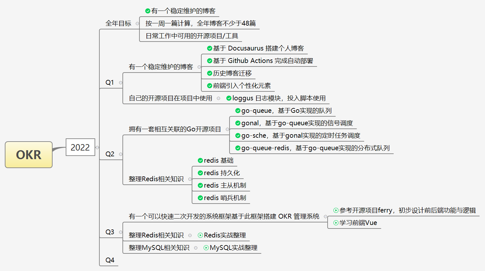

<!--
😀😁😂😃😄😅😆😉😊😋😎😍😘😗😙😚😇😐😑😶😏😣😥😮😯😪😫😴😌😛😜😝😒😓😔😕😲😷😖😞😟😤😢😭😦😧😨😬😰😱😳😵😡😠
💪👈👉☝👆👇✌✋👌👍👎✊👊👋👏👐✍
- 坚持学习
- 复制盈利模块
-->

:::info 😎😎😎 珍妮特·温森特 😎😎😎
一个人不应该过分自省，这会使他变得软弱。     
理智的做法，只有在做很小的决定时才有效。   
至于改变人生的事情，你必须冒险。     
:::

## 个人信息
---

**个人：**陈大哥 / 男 / 1995.09        
**职业：**后端工程师      
**邮箱：**972542655@qq.com      
**常住地区：**湖北-武汉  
**教育经历：**[武汉科技大学](https://www.wust.edu.cn/)  / 工业工程 / 本科 / 2014届 / GPA 3.78（4.0）

## 工作经历
---

### **2020.06 ~ 至今**  
**公司：**[武汉安天信息技术有限公司](https://www.avlsec.com/zh-hans/home)  
**职位：**后端研发工程师  
**工作职责：**       
- 负责核心业务**云查引擎**的研发与维护。
- 负责内部安全作业平台（特征运营系统、误报测试系统等）日常维护。
- 承担部分安全作业平台管理工作，定期汇总、汇报。
- 负责部分老旧系统（SDKConf配置管理系统）维护。

### **2018.06 ~ 2020.06**  
**公司：**[武汉数博科技有限公司](http://www.dnect.cn/)   
**职位：**后端研发工程师  
**工作职责：**    
- 负责研发与维护分布式爬虫调度系统。
- 负责攻克重难点（js、android）逆向技术。
- 负责攻克字符型验证码识别。例如：裁判文书网、搜狗微信等。
- 承担部分垂直领域爬虫维护。

## 技术栈
---
* **编程语言**：`★★Python`、`★☆Go`
* **Web框架**：`★☆Iris`、`★☆Flask`、`★Tornado`、`☆Gin`、`☆Django`
* **数据库**：`★☆MySQL`、`★Postgres`、`☆MongoDB`
* **缓存**：`★★Redis`
* **消息队列**：`★★RabbitMQ`、`☆Kafka`
* **前端**：`☆Vue`、`☆Bootstrap`、`☆HTML5`、`☆Electron`
* **运维相关**：`★Docker`、`★Kubernetes`、`★Gitlab-CI`、`★Jenkins`

## 项目经历
---

:::info 2020~2022
安天
:::

### 云查引擎
#### **关键字：**
百万并发、Redis、gRPC     

<!--
云查主要提供两种检出能力：  
常规云查：重点在于反病毒能力     
风险云查：重点在于对广告、非法获取权限、色情等安全隐患的判断能力   
-->

#### **简介：**    
&nbsp;&nbsp;&nbsp;&nbsp;&nbsp;&nbsp;&nbsp;&nbsp;云查引擎是一款为终端提供云端病毒查询服务的产品，该产品依托于大数据平台赋能，由云查API、KV-DB、云查数据加工等模块联动组成。支持快速上下线规则、定向多元打击等能力。      
&nbsp;&nbsp;&nbsp;&nbsp;&nbsp;&nbsp;&nbsp;&nbsp;2018年以前，整个云查项目的定位，就是作为终端引擎的缓存。整体还处于demo级别，没有什么流量，甚至没有引入数据库资源，病毒数据大部分硬编码在程序内部。         
&nbsp;&nbsp;&nbsp;&nbsp;&nbsp;&nbsp;&nbsp;&nbsp;2018年以后，云查逐渐转正。在此期间，引入MySQL作为数据存储，提供数据支撑。引入Redis作为缓存，提供高性能保障。同时，引入一个脚本实时接收数据并完成数据更新。每日数据更新量在几百至几千。           
&nbsp;&nbsp;&nbsp;&nbsp;&nbsp;&nbsp;&nbsp;&nbsp;2020年左右，云查业务上量。为了后续扩展，在云查架构上做出调整，整体将云查拆分为三大板块（见下）。其中，云查负责业务逻辑，KV-DB负责数据存储，二者基于gRPC建立查询连接。        

|云查引擎|说明|
|---|---|
|云查|提供HTTP业务查询接口|
|KV-DB|提供gRPC数据查询接口|
|云查数据加工|包含爬虫、定时脚本、数据清洗等，为云查提供数据更新| 

&nbsp;&nbsp;&nbsp;&nbsp;&nbsp;&nbsp;&nbsp;&nbsp;2021年以后，业务持续上量，当前数据同步方案存在较大缺陷，导致线上数据更新异常。**新KV-DB**研发正式启动，旨在解决弱网环境下数据可靠性问题，以保障异地多活场景下的数据最终一致性。      
&nbsp;&nbsp;&nbsp;&nbsp;&nbsp;&nbsp;&nbsp;&nbsp;2022年新KV-DB正式上线投入使用。     

#### **职责：**         
* 负责新KV-DB的设计与研发。
* 负责云查数据加工开发与维护。

#### **亮点：**    
* 新KV-DB引入**版本管理**概念，设计**ensure/publish协议**，解决弱网环境下数据可靠性问题，保障异地多活场景下的数据最终一致性。
* 合理设计**业务分流、云查本地缓存**等一系列方案，抗住高峰期百万并发压力，日活二十亿+。
* Redis Key 调优，String类型底层raw编码转成embstr编码，减少动态字符串类型内存分配与内存碎片。
* 高频 Key 转 Redis 唯一 Key，减少大量内存分配，提高50%存储空间。
* GOMAXPROCS定位及调优。
* 基于k8s Daemon 部署

#### **补充：**     
* 当前体系已经逐渐庞大，后续KV-DB考虑迁回MySQL，采用**binlog**方式实现异地多活。

### 误报测试系统
#### **关键字：**
TB级快速扫描、分布式架构      

#### **简介：**      
&nbsp;&nbsp;&nbsp;&nbsp;&nbsp;&nbsp;&nbsp;&nbsp;内部作业系统在对外发布病毒规则前，需要先进行一轮内部防误报测试。以便减少这批规则的误报几率。     
&nbsp;&nbsp;&nbsp;&nbsp;&nbsp;&nbsp;&nbsp;&nbsp;误报测试系统就是这样一道门栏，他的防误报能力和样本数量直接挂钩。
样本数量越多，防误报效果越好，但所需要的扫描时间也越多。而业务侧的述求自然就是样本尽可能多、扫描时间尽可能少。
所以如何在样本量级和扫描时间之间做出一个均衡，是很重要的点。

#### **职责：**
* 负责新误报测试系统设计与研发。

#### **亮点：**
* 新误报测试系统采用分布式架构，提高误报测试扫描速度。实现 3TB样本/1小时 的扫描速度。
* 定位系统瓶颈，引入备份存储搭建多消费集群，实现 3TB样本/半小时 的扫描速度。
* 基于k8s

#### **补充：**
* 当前样本量不满足业务述求，后期考虑转让大数据组，基于hadoop实现。

### 通用下载服务
#### **简介：**    
&nbsp;&nbsp;&nbsp;&nbsp;&nbsp;&nbsp;&nbsp;&nbsp;样本是病毒库的重要输入来源。样本越多，来源越广，病毒库能力越强。
为了扩大样本库，需要支持多元的样本来源，包括厂商样本交换、应用市场爬虫等。不同的样本来源，往往有不同的下载方式，包括HTTP/FTP/SFTP/BitTorrent等。           
&nbsp;&nbsp;&nbsp;&nbsp;&nbsp;&nbsp;&nbsp;&nbsp;为了简化流程，需要设计通用的下载服务，用于对接多元的下载源。

#### **职责：**    
* 负责通用下载服务的设计与研发

#### **亮点：**   
* 基于ari2搭建的通用下载服务，支持HTTP/FTP/SFTP/BitTorrent等多种下载协议
* 为什么不做下载中心，带宽等资源不好复用
* 基于k8s

### CICD
#### **关键字：**
Gitlab-CI、Jenkins

#### **简介：**    
搭建研发代码规范及质量体系

#### **职责：**
* 协助搭建研发代码规范及质量体系

#### **亮点：**
* 基于Gitlab-CI

:::info 2018~2020
数博 
:::

### 字符型验证码识别平台
#### **简介：**    
&nbsp;&nbsp;&nbsp;&nbsp;&nbsp;&nbsp;&nbsp;&nbsp;基于卷积神经网络搭建数字字符型验证码识别平台，提供验证码识别接口。
针对图片的难度，可快速适配多种卷积模型来进行训练，对简易验证码实现快速训练，对复杂验证码实现精度更高的训练。
训练过程中，自动调节保留率，即随着正确率的增加，训练识别错误的验证码则有更大概率保留到下一次，以便加强训练。

#### **职责：**   
* 负责机器学习算法调研与研发
* 验证码爬虫与打标

#### **亮点：**   
* 使用卷积神经网络算法，自训练模型
* 目前已训练有搜狗微信、创宇、京东、苏宁等数字字符验证码

### 分布式爬虫调度服务
#### **简介：**    
&nbsp;&nbsp;&nbsp;&nbsp;&nbsp;&nbsp;&nbsp;&nbsp;基于生产者消费者模型搭建的分布式爬虫调度服务平台。
该平台提供了管理界面，用于手动/定时触发、停止爬虫任务，且支持多任务之间的优先级调度。
在实现上，基于agscheduler实现的任务调度，基于RabbitMQ实现生产者消费者模型的Broker，并实现任务优先级任务分发。
基于rpc实现爬虫节点启动后在生产者端注册。     

#### **职责：**      
* 负责分布式爬虫调度服务研发与维护。     

#### **亮点：**      
* 引入rpc机制，实现爬虫节点注册，支持实时中断爬虫任务，获取节点信息。     

### 爬虫项目
#### **简介：**       
这是一个反爬虫与反反爬虫之间的技术斗争。   

#### **亮点：**       
* 中国裁判文书网，旧版sojson.v5反爬、js混淆加密（最新版瑞数反爬未攻破）。js混淆加密技术，动态生成随机密钥，实际解析逻辑经jsfuck编译为不可读的代码，由eval来执行该段字串。
* 搜狗微信，验证码反爬、js加密。验证码为5-7位，且干扰信息严重，无法通过普通机器学习识别。js重定向，根据url动态生成数组信息，按照规则拼接出重定向后的链接。
* 自如网，房价数据加密。数据存储在js和css中，需要综合图片、js、css等获取最终信息。
* 58同城，房价数据加密。房价被字体加密，需要编译font字体文件，获取对应的数字映射关系。
* 京东商城，验证码反爬。爬取营业证件信息时出现4位字符验证码。
* 苏宁易购，验证码反爬。感觉和京东差不多。
* 美团外卖，js混淆加密。

### 数据报表平台
#### **简介：**      
&nbsp;&nbsp;&nbsp;&nbsp;&nbsp;&nbsp;&nbsp;&nbsp;客户购买数据服务后，会定期以 excel 的形式反馈我司数据中可能存在的问题（脏数据、异常数据等）。
为了减少此流程中的人力投入，需要一套完善的自动化处理工具。        
&nbsp;&nbsp;&nbsp;&nbsp;&nbsp;&nbsp;&nbsp;&nbsp;数据报表平台基于此背景建立。
该平台采用后端分离架构（Flash & Vue），实现了包括文件投递、自动解析、脏数据清洗、爬虫定位等，报表生成等功能。   

#### **职责：**
* 负责前后端设计与研发

## 开源项目

### [pywss](https://github.com/czasg/pywss)

### [loggus](https://github.com/czasg/loggus)

### [go-queue](https://github.com/czasg/go-queue)

### [gonal](https://github.com/czasg/gonal)

### [go-sche](https://github.com/czasg/go-sche)

### [go-fill](https://github.com/czasg/go-fill)

## 自我认知
**性格方面**：个人性格偏活泼，比较好相处。

**工作方面**：态度积极，责任心强。不管是不是我的事，经了我的手，就是我的事。曾多次临时接手遗留瘫痪系统并使其正常运行，属于认真实干的一类人。

**学习方面**：喜欢自己造轮子，也喜欢分享。去年组织十余次技术分享，主题包括Docker、Go相关知识。也一直希望身边有很多大佬，可以让我模仿学习~

<!--
应届毕业入职公司，主要学习各种基础技能与知识。包括：   
1、学习 Python 并开发脚本协助日常工作。     
2、学习团队下 Git 的协作规范。

通用
有良好的代码风格，注重代码质量，通过学习 XXX，XXX 等多个开源项目的架构与源码，确保代码具备健壮性与扩展性。
具备良好的代码编程习惯及文档编写能力，参与 XXX，XXX 项目的核心部分代码编写，重构和维护。能进行技术攻关，突破关键技术瓶颈。
负责根据公司业务及目标引进人才、培养新人、规划团队人员、并建立完善的绩效考核制度有效留住人才，提高工作效率。
带领 10 人团队完成分布式系统的难点分析与架构设计工作，承担 XXX 等核心功能代码编写，开发与维护系统核心模块。使用 XXX 等工具协助持续集成 与自动化部署，保证代码的可靠和安全。
X 年 Java 开发经验，熟悉 JVM，MySQL，Java 多线程，计算机网络等基础原理以及运行机制，熟悉Spring， Spring Cloud 等第三方框架的原理以及使用。
X 年 Java 开发经验，作为核心成员参与了多款千万级 DAU，过亿下载量的 XXX 开发迭代，对 coding 有热情，在项目迭代，性能优化，疑难问题排查等方面都有可靠的攻坚能力，在公司内部组织过数次技术分享，主题包括 XXX, XXX 等。
参与 XXX 项目的全流程，包括需求评审、设计评审，制定测试计划，设计和执行测试用例，及测试回归，进行缺陷跟踪和软件质量分析等。
善于发现以及解决问题，持续改进 XXX 系统的架构和核心技术，保证系统的稳定性、高性能、高可用性和可扩展性；
善于利用工具和代码减少重复性劳动，开发了 XXX 工具提高团队的工作效率。
熟练使用 MVC 模式进行项目设计，熟悉单例，工厂模式等常见的设计模式和通知机制。
对软件架构进行搭建，规划，优化应用架构逻辑，提升通信传输效率与安全性。具备良好的编码和文档习惯，能持续的关注和优化项目。
基于海量数据，挖掘信息，建立模型，并将机器学习算法应用于业务环节，提升公司各环节效率。调研新技术在大数据领域的应用价值，以技术驱动产品，把最合适的算法应用到各种有挑战性的现实场景中。
负责公司技术文档的编写以及维护，定期 Review 团队的代码，与团队共同学习以及成⻓。
去年度组织了十多次技术分享活动，主题包括 XXX，XXX。
有良好的代码编写习惯，具有良好的沟通、协作能力能力，有良好的职业道德和较强的工作责任感。
理解操作系统中进程、线程、死锁、虚拟化、文件系统等原理和简单实现。
拥有扎实的统计学功底，对数据敏感、深刻理解和熟练运用各类主流机器学习算法，包括线性模型、树模型、概率图模型、深度学习模型等。
拥有 X 年以上工业界通用机器学习算法项目的研发经历，熟悉大规模机器学习、深度学习、分布式计算等相关技术。
动手能力强，对算法有极大热情，具备良好的文献学习能力，能对算法进行实现和持续优化。
熟悉 Web 编程，能够使用主流框架进行网络页面的开发。推动研发流程过程改进，影响和推动整个研发团队的质量意识，能提升整个研发效能。
和产品经理密切配合，从需求出发，主导系统分析与架构设计工作，承担核心功能代码编写，开发与维护系统公用核心服务。
有大型互联网分布式系统的架构设计和开发经验，拥抱新技术，有很强的学习能力。
喜欢钻研语言底层与框架原理，熟悉多种算法、函数式开发等编程技术，能流畅阅读英文文档。
思路清晰严谨，具有良好的代码编写习惯，善于倾听和团队合作。
有扎实的计算机理论基础，良好的算法与数据结构基础，了解计算机基本原理与常见机制。
善于与人沟通，良好的团队合作精神和高度的责任感，能够承受压力，有较强的吃苦耐劳和创新精神。
主导技术难题攻关，解决各类潜在系统技术风险，保证系统的可靠性以及稳定性。
深刻理解面向对象开发，具有较好的系统分析设计能力、文档撰写能力。
对技术有强烈兴趣，学习能力强，技术视野广阔，乐于不断学习新知识；
具备扎实的 OOP 及相关软件开发技能，能根据架构要求，开发设计可扩展，可复用，高性能的功能模块。
掌握软件工程思想，能够对复杂任务分解，熟悉软件迭代开发方法，具备良好的沟通能力和解决问题的能力。
深入理解MySQL InnoDB存储引擎原理，索引优化，Redis分布式锁 以及缓存穿透，缓存雪崩的解决方案。作为团队的核心成员，曾负责 XXX XXX XXX等多个项目的架构设计与核心代码的实现，日活最高达到40W，累计用户有200万，QPS 达 到 200/秒。
了解 HTTP，TCP/IP，Websocket 协议，熟悉处理网络请求，XML 和 JSON 数据解析以及本地缓存。
熟悉 Socket 网络编程，了解 TCP、UDP、HTTP、FTP 等常用网络协议。
熟悉移动网络通信机制，对 HTTP、TCP/IP 协议有较深刻的理解，熟悉网络性能优化且有成功实施经验。

后端简介：
熟悉使用 Tomcat 应用服务器的应用部署和配置，熟悉 jenkins 自动化部署、测试。
了解数据分析库 Numpy 和 Pandas、matplotlib 的原理，有数据处理、分析和建模的经验。
掌握 Django，Flask 等开源框架设计原理及运行机制，熟悉 LAMP/LNMP 系统架构设计，有高并发 WEB 应用架构经验。
深入掌握 MySQL 索引优化以及慢查询优化，Redis分布式事务及缓存穿透，缓存雪崩的解决方案。
熟悉常用开发版的 Linux 服务器安装、配置和调优，熟悉常用开发环境如 Apache、MySQL、Nginx 等工具的部署、设置及调优。
熟悉 Java 语言，掌握 Spring、Springboot 等主流框架，了解 Memcache、Redis 等缓存组件与 RabbitMQ 异步处理机制。
了解高可用、高并发，高负载的架构，具有分布式架构的系统开发能力。
熟悉流式计算，olap，列式存储等技术原理。熟悉常用机器学习、深度学习算法，具有将大数据或机器学习应用于虚拟网络的经验。
熟练掌握常见的关系型数据库以及非关系型数据库，理解其使用场景及限制。
负责公司服务器的规划、调试优化、日常监控、故障处理、数据备份、日志分析、性能瓶颈分析等工作。并负责线上服务器实时维护、提高系统的可用率及可维护性。
熟悉 Spring、MyBatis、Hibernate 框架，并参与设计多个高可用性项目。
熟练使用 Oracle/MySQL 数据库，对于 Mongodb 等 NOSQL 数据库具有一定的了解，拥有一定的数据库设计能力和优化能力。
熟悉 TCP/IP、DNS 等底层协议，精通 HTTP 协议，熟练掌握各种工具进行网络问题诊断。
精通 golang 协程，channal 和锁等机制，对高并发、高可用架构系统有正确、深刻的理解，有分布式服务器开发经验。
Java 基础扎实, 熟练使用 spring, spring boot, mybatis等工具并了解其实现原理。
熟悉 Tomcat、Weblogic，WAS 等主流应用服务器的环境搭建及维护。
精通 MySQL 应用开发，熟悉数据库原理和常用性能优化技术。
了解 Django，Flask 框架的设计和实现原理，熟悉分布式系统的设计和开发，对系统高可用有一定经验。
熟悉 Redis持久化、MySQL主从架构 等数据库机制与原理，熟悉 Shell脚本 编写、Linux 系统及常用命令。
两年以上 Go 项目开发经验，熟悉主流 Go 语言下常用的 RPC 框架，深入了解 Go 语言内部运行机制，对 Go 源码有一定的了解。
JAVA 基础扎实，对 JVM 有一定了解，能对 JVM 做性能分析及调优。
熟练掌握 PHP 语言 Laravel 框架，yii 框架与常用工具，有丰富的 LAMP 开发与良好的 Web 网络编程经验。
熟悉 Docker 微服务架构，Redis, Memcached 缓存技术，Nginx 负载均衡，RabbitMQ 消息队列等领域。
熟悉 Python 爬虫系统的设计，能编写高质量网络爬虫，识别常见验证码（爬取过知乎，淘宝等网站数据）了解 Celery 分布式爬虫机制。
深熟练掌握全栈开发，对后端到前端的技术原理有全面的认识，熟悉网站开发流程，能够独立搭建完整的网站。
深入理解数据结构与算法，并能够实现哈希表、链表、队列、栈、二叉树等数据结构。
扎实的 Python 基础，熟悉文件 I/O、多线程、装饰器、基础数据结构及模块化。
使用 GitLab 等工具对项目进行持续集成，保证项目能够快速上线以及及时回滚
设计 MySQL 基于 XXX 搭建主从架构，使用 Mycat 实现分库分表、读写分离以及高可用
熟练基于 Scrapy 框架进行分布式爬虫，利用 Xpath，BeautifulSoup，Re 库进行数据清洗，并解决验证码，登录，Javascript混淆，等各种反爬措施。
熟悉 Socket 网络编程、了解多线程、多进程、异步I/O、I/O多路复用如 select、poll、epoll的原理及使用。
使用 Flask，SQLAlchemy, Mysql，Redis 协助完成数据管理模块，并通过测试工具优化 15% 后端 API 接口性能。
协助运维监控 6台 后台服务器以及 3台Redis 服务器。保证 uptime 达到 99%。
熟练使用 Selenium, Puppeteer 进行页面测试，构建单元测试，自动化测试
熟悉 Django web 开发框架，熟悉 MVC 模型，熟悉中间件、Admin 站点管理、图片上传、分页，邮件传输。
掌握 MySQL 数据库的基本原理与常用语法，了解 MongoDB、Redis 等 NoSQL 数据库；
熟悉 Mysql 工作原理及程序上如何高性能配置，了解主流开源 NoSQL 系统（Memcached、Redis、MongoDB等）的使用和原理，有分布式系统使用经验；
使用 Scrapy 框架对采集目标进行数据收集，跟踪网页链接构建分类信息字段分析目标网址，使用** Xpath, Re **库提取信息。通过抓包工具获取 Ajax 链接并解析 json 数据。

独自负责客户端从无到有的产品设计，研发，流程图及开发文档，用两个月的时间独立开发了初版的 APP，集成了支付模块、文件下载，数据本地缓存功能。
负责项目管理，产品研发部门的工作任务分配，工作细化划分，保证项目按时上线。
与产品经理保持沟通，对订单管理模块进行维护与高效重构，一个月修复超过后台管理系统 30个 Bug。
与设计、运营等合作部门沟通协作，推动产品的实现与最终效果的评估，制定产品的测试标准，上线标准，并进行数据跟踪分析。
构建 ip 代理池，cookies 池，开发用户个人信息爬虫，编写各种反爬虫算法，爬取用户个人信息和微博内容。并负责数据的清洗、解析、爬取的去重以及进行数据挖掘与研究。
作为软件开发团队的核心成员，为大数据应用设计开发高质量的软件平台。对微服务架构组件有实践经验，理解常见架构的高可用性与可扩展性。
有项目云服务化或者相关开发以及项目调优，部署经验。熟悉大规模、高并发系统架构设计，能独立完成系统的设计及开发。
后端经验
改造了 Laravel 的队列服务，使用 MySQL 实现存储与分发队列服务，实现了水平扩展，提高系统可用性，减少了 30% 服务器数量。
从设定 Linux 环境，编译 MySQL，设定 Apache 与 Nginx 等服务器，到最后 PHP 的开发环境及参数设定，学习架设 LAMP，XAMMP 等开发环境。
负责 XXX 系统的设计以及研发，帮助部门实现手机端以及网页端的统一管理。
使用 XXX 机制对 XXX 系统进行重构，解决了缓存穿透以及缓存雪崩问题，提高了 200% 系统可用性。
对 XXX 代码库进行封装以及维护，并且根据业务需求对代码库进行更新，提高代码复用率。
使用 XXX 实现数据库连接池，提高数据库性能并且解决数据不一致问题。
使用 Redis 分布式锁以及消息队列对电商业务进行解耦，减少 30% 业务模块开发时间。
基于 XXX，XXX，开发的内部协作系统，包括文档写作、Wiki 共享、评论关注等模块，支持导出与生成 Word 与 PDF 格式文件。
开发自研可靠消息服务，在 RocketMQ 使用之前使用的是可靠消息服务保证消息的最终一致性。
基于Dubbo，ZK，Spring Boot 微服务架构，完成对 XXX 系统核心业务功能的开发工作
使用 K8S 实现微服务管理模块，实现了分布式任务调度，任务发现等核心功能。
通过慢查询定位 MySQL 数据库查询瓶颈，通过 SQL 优化以及修改索引将查询时间从 1200ms 降低到 40ms

姓名+岗位名+电话
-->
