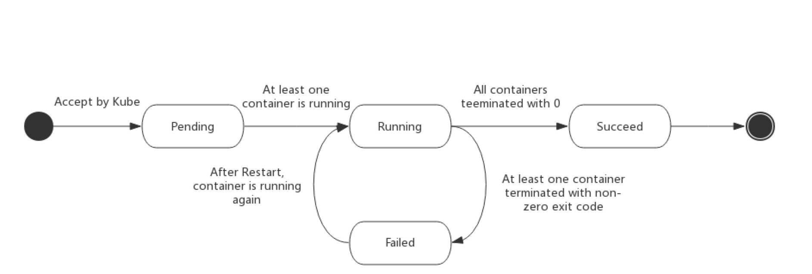

## Pod 概述
`Pod` 是 k8s 中可以创建和部署的最小单位，每一个 `Pod` 都代表着集群中运行的进程。

在 Docker 中基础单位是容器，但不同的是，一个 `Pod` 中可以拥有多个容器，他们之间共享网络、存储等资源。
除了应用容器之外，还拥有 `pause`、`init`、Hook、Probe、Preset，PDB等概念。

:::tip 网络共享
每个 Pod 都会分配一个唯一的 IP 地址，Pod 内的每个容器之间可以直接通过 localhost 相互访问。  
他们可以通过 IPC 实现通信，但不同 Pod 之间，拥有不同的 IP 地址，不能简单的通过 IPC 进行通信。
:::

:::tip 存储共享
Pod 内的容器拥有独立的存储，但是可以通过指定多个共享的 Volume 来实现 Pod 内容器的存储共享。
:::


我们整理下有关 Pod 的描述：
* 是 k8s 中创建和部署的最小单位
* 是一个服务的多个进程的聚合单位


## Pod 使用
`Pod` 生命周期是有限的，包含创建、调度、进程终止、销毁等流程，在其设计之初就不是持久化实体，每一个 `Pod` 都是用后即毁的实体。所以我们很少直接创建并使用 `Pod`。

在 k8s 中存在一种类型，可以用于创建并管理 `Pod` 的生命周期，我们把它叫做 `Controller` 控制器。  
`Controller` 可以创建并管理多个 `Pod`，并提供副本管理、滚动升级和集群级别的自愈能力。在 k8s 集群中如果出现某个节点故障，那么该节点上的 `Pod`，就会被调度到其他节点上，并尽量维持 **期望状态**。

我们常说的 `Controller` 包括：  
* Deployment：无状态集合控制器
* StatefulSet：有状态集合控制器
* DaemonSet：守护进程控制器


## Pod init 容器
在 `Pod` 中有多个特殊容器，其中就包含 `init` 容器。 这是一种专用的容器，该容器主要的功能就是执行初始化，在应用容器启动之前运行，用来初始化一些应用镜像中依赖的工具、环境、脚本等。

`init` 容器设置和常规容器完全一致，但是部分属性使用场景有所不同。比如 `init` 容器不支持 `Readiness Probe`，因为他需要在 `Pod` 就绪之前运行完成。

如果一个 `Pod` 指定了多个 `init` 容器，那么这些 `init` 容器会严格按照串行顺序执行。

常见 `init` 容器使用场景：
* 使用 GIT 拉取远程仓库到公共 `Volume`。
* 在启动时注册 `Pod` 到指定服务器。
* 在启动时跑个环境初始化脚本。


## Pod pause 容器
除了 `init` 容器之外，`Pod` 还有一个核心的特殊容器，叫做 `pause` 容器，也叫 `infra` 容器。

在介绍 `pause` 容器之前，我们需要先了解下 Docker 网络知识。  
在 Docker 网络中有一种特殊的使用方法 `--link`，叫做 **网络连接**，当然该方法一般是不推荐使用了，现在推荐使用 `--network`。
```shell script
>>> docker run --rm --network=container:pause --ipc=container:pause --pid=container:pause test
```
网络连接的意思，就是将某个容器的网络，和目标容器打通，那么打通后的两个容器，就像部署在了一个网络里，容器之间是可以相互访问的。

我们在回到 `Pod` 中来看，会发现 `Pod` 本身就是多个容器的合集，而且这些容器是共享网络资源的，可以通过 `localhost` 相互访问。  
那么说到这里，你应该也会有些好奇，那就是一个 `Pod` 内的网络共享是如何实现的呢？

其实 **网络连接** 就可以很好的解决这个问题，比如我们先起一个容器，然后用其他的容器连接到这个容器，这样不就完成了网络共享的能力吗？

虽然这是一种实现方式，但是又会引入另一个问题，那就是多个容器并行时，先启动那个容器作为基础网络呢？如果不同容器之间网络条件不一致，是不是又要引入一大堆的择优算法呢？这么设计下来，岂不得不偿失。

所以在 k8s 中，有这么一个特殊容器，也就是我们的 `pause` 容器，他由一个非常小的镜像启动，大概700K左右，而且启动后永远 **暂停**。  

这样所有的问题就都解决了，`Pod` 初始化时内部启动一个永远暂停的 `pause` 容器，接着后续创建的容器，都通过 **网络连接** 的方式加入到这个网络中，从而实现了网络共享。

我们整理下 `pause` 容器的作用：
* 在 `Pod` 中担任网络命名空间共享的基础
* 启动 pid 命名空间，开启 `init` 进程。（`pause -> init`）


## Pod 生命周期
`Pod` 的 `status` 字段是一个 `PodStatus` 对象，该对象中有一个 `phase` 字段，用于表示当前 `Pod` 的相位信息。

|phase|描述|
|---|---|
|Pending|挂起状态。表示当前 Pod 已创建，正在等待调度|
|Running|运行状态。|
|Succeeded|成功状态。当前 Pod 内所有的容器都已经正常终止（exit 0）。|
|Failed|失败状态。当前 Pod 内至少有一个容器异常退出（exitcode != 0）。|
|Unknown|未知状态。因为某些原因无法获取当前 Pod 状态，一般是 Pod 所在主机失联导致。|

下图是 `Pod` 的生命周期示意图，描述了 `Pod` 状态的变化。

<>
  <h6 align="center">
    <b>Pod 的生命周期示意图（图片来自网络）</b>
  </h6>
</>

## Pod 容器探针
容器探针是 k8s 对容器执行的定期检查，用于保证容器的健康运行。

k8s提供了三种探针执行方式：
* ExecAction：执行命令行检查
* TCPSocketAction：执行 TCP 端口检查
* HttpGetAction：执行 HttpGet 请求检查

探针类型则包括了 **就绪探针** 和 **存活探针** 两种。

:::tip 就绪探针
`readinessProbe`，常用于检测容器是否可以正常提供服务。
:::

:::tip 存活探针
`livenessProbe`，常用于检测容器是否存活。
:::

## Pod 容器钩子
容器钩子是 k8s 在容器生命周期基础之上提供的附加能力，用于当容器启动或退出时执行。

k8s提供了两种种钩子执行方式：
* Exec：执行命令行指令
* Http：执行 Http 指令

钩子类型则包括了 **postStart** 和 **postStop** 两种，分别表示容器的启动与退出。

## Pod 预设
当 `Pod` 创建时，希望额外注入一些基础信息，这就是 `Pod Preset` 预设能力。

一般编写 `Pod` 配置文件时，就应该写好你需要的基础信息。

当然，为了简化配置，我们可以将一些常用的基础配置信息取出，放到预设模块中，这样我们的 `Pod` 配置看上去就更加简洁。


## Pod 中断预算
通常，`Pod` 的创建和管理由 `Controller` 来控制，但是在某些特殊场景，可能无法满足需求。我们来看一个这样的场景：

集群中有三台节点服务器，且部署有一个 `Deployment` 的控制器对象，该控制器创建并运行了六个 `Pod`，每个节点各分配了两个 `Pod`。

而且业务要求，至少需要保证3个 `Pod` 的存活，才能够确保业务的正常运行。

我们知道了控制器会管理 `Pod` 并将其维持在一个 **期望状态**，即使集群某个节点异常了，控制器也会在其他正常节点重新创建并调度 `Pod`。

现在，我们直接通过指令 `kubectl drain` 驱逐集群中的两个节点，这时会发生什么事呢？

我们会发现，两个被驱逐的集群上的 `Pod` 正在退出。然后剩下的正常节点正在重新创建四个 `Pod`，看上去都很完美。

等等，当前可用的 `Pod` 好像只有两个了...


在这种场景下，`Controller` 控制器提供的管理能力就无法满足需求了。所以，k8s 又提出了一种概念，`PodDisruptionBudget` 中断预算，也叫 `PDB`。

`PDB` 能够在某些特殊的场景下，确保当前 `Pod` 数量至少维持在某个值以上。为什么说是特殊场景，因为 `Pod` 中断场景很复杂，包含 **自愿中断** 和 **非自愿中断**。

:::note 非自愿中断
管理人员主动驱逐  
节点物理故障  
节点资源不足导致被驱逐  
程序panic  
:::

:::note 自愿中断
管理人员主动更新Controller    
管理人员主动删除Controller、Pod    
:::
