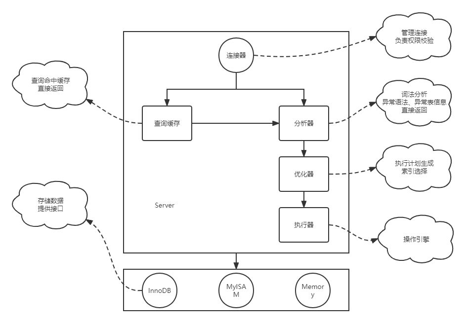

MySQL 是 RDBMS（关系型数据库管理系统）应用软件之一，简单点理解，是一个用于存储、管理、访问数据的数据库管理应用。

## mysql 基础架构
MySQL 可以分为服务层和存储引擎层两个模块。  
  
**服务层**：
* 连接器：负责与客户端建立连接，获取权限，维持和管理连接。
* 查询缓存：对于查询请求，会先到查询缓存查看是否存在缓存，存在则会直接返回。
* 分析器：对执行语句做"词法分析"，存在逻辑错误或者资源错误，会在此处抛出异常。
* 优化器：当存在索引时，优化器会根据当前表情况，选择最佳的执行方式。
* 执行器：调用引擎层接口执行命令。执行前会先检查表的权限。

**存储引擎层**，负责提供数据的存储和提取。其架构模式是插件式的。默认引擎是 InnoDB。

## 查询一条语句
```sql
SELECT * FROM table WHERE ID = 6;
```
在此 sql 中，假设没有索引，那么一次简单的查询流程类似：    
1、调用 InnoDB 引擎接口获取 table 表的第一行数据，判断 ID 是否等于 10，如果是则将这行数据存储在结果集中，不是则跳过。
2、调用 InnoDB 引擎接口获取下一行，重复判断并执行，直至表数据全部执行完。

## 更新一条语句
更新流程和查询流程不一样，还涉及到日志模块：**redo log**（重做日志） 和 **binlog**（归档日志）。

#### redo log
redo log 是 InnoDB 特有的一种日志。   
它其实是我们常说的 WAL（Write-Ahead Logging）预写日志的一种实现，即先写日志，再写磁盘。   
具体来说就是，InnoDB 会先把日志记录写到 redo log 中，然后更新内存，此时就算完成了更新。    
后续 InnoDB 引擎会再适当的时候，将这个操作记录刷新到磁盘里。这种一般是再系统比较空闲的时候。   
通过 redo log，InnoDB 引擎也实现了 crash-safe 能力。

#### binlog
和 redo log 这类引擎日志不同，binlog 是服务层的日志。为什么会有两份日志呢。   
因为最初 mysql 默认引擎是 MyISAM，他没有 crash-safe 的能力，后面的 InnoDB 引擎对此进行了补充。

这两种日志有一定的区别：   
1、redo log 是引擎特有的日志。binlog 是 mysql 服务层实现的，所有引擎都可以记录。  
2、redo log 是物理日志，记录的是再某个数据页上做出了什么修改。binlog 是逻辑日志，记录的是语句的原始逻辑。类似："给ID为2的c字段加一"  
3、redo log 是循环写，binlog 是追加写。

```sql
UPDATE table SET c = c + 1 WHERE ID = 2;
```
再此 sql 中，假设有主键索引，那么一次简单的更新流程类似：  
1、执行器先找到 ID 为 2 的这一行数据。当 ID 是主键时，引擎可以直接通过索引找到这一行。如果 ID 为 2 的这一行数据就在内存中，则直接返回。否则需要先从磁盘读入内存，然后再返回。   
2、执行器拿到引擎返回的数据，把对应字段的值加上一。这样就得到了一行新数据，然后再调用引擎写入这行新数据。  
3、引擎将这行新数据更新到内存中，同时将这个更新操作记录到 redo log 中。此时 redo log 处于 prepare 状态。然后响应执行器。  
4、执行器将这个操作生成 binlog，并写入磁盘。   
5、执行器调用引擎提交事务的接口，引擎将 redo log 的状态改为 commit 状态即可，一次更新事务就完成了。

最后几步关于 redo log 的状态的处理，属于**两阶段提交**。    
这是为了更好的应对 crash 场景：
* 先写 redo log 再写 binlog：当 redo log 写完，binlog 还没写，此时 crash。那么恢复后的数据，就没有记录到 binlog 中。
* 先写 binlog 再写 redo log：当 binlog 写完后 crash，此时恢复后的数据，相较于原始数据，会多出来一部分操作。
如果没有两阶段提交，那么crash恢复后的场景，可能会出现恢复前后状态不一致的场景。

## 事务
说到事务，我们肯定会想到：ACID（原子性，一致性，隔离性，持久性），这也是事务的一些特点。    
在数据库中，事务是要保证一组数据库操作，要么全部成功，要么全部不成功。   
事务是由引擎实现的，比如 InnoDB 支持事务而 MyISAM 不支持事务，这也是 MyISAM 被取代的重要原因之一。    

#### 隔离级别
数据库中有多个事务同时执行时，会出现：**脏读**、**不可重复度**、**幻读**等问题。    
为了解决这些问题，就有了**隔离级别**的概念。

隔离级别有：   
* read uncommitted：读未提交，一个事务未提交时，它的变更就已经可以被其他事务看到。
* read committed：读已提交，一个事务提交后，它的变更才能被其他事务看到。
* repeatable read：可重复读，一个事务在执行过程中看到的数据，总是和事务启动时看到的数据是一致的。
* serializable：串行化，严格按照先后顺序执行事务。

在实现上，数据库会在命令执行期间创建视图，访问的时候以视图的逻辑结果为准。    
在读未提交隔离级别，没有视图概念，直接返回当前记录的最新值。     
在读提交隔离级别，视图是在每个 sql 开始执行的时候创建的。     
在可重复读隔离级别，视图是在事务启动的时候创建，整个事务期间都在使用这个视图。  
在串行化隔离级别，则直接通过加锁的方式来避免并行访问。   

视图是基于**多版本并发控制（MVCC）**实现的。    
例如可重复读隔离级别下的事务，在执行时会申请唯一的版本号，以这个版本号作为视图，可以避免其他事务的影响。

#### 视图
在数据库中，即使有上百G的数据，事务也可以一瞬间启动。而且启动事务的时候会生成视图，那为什么会这么快呢？

事务的原理是启动时生成一个唯一的事务ID（transaction id）。而在数据库中，每行数据也都是有版本的。   
每次事务更新时，都会生成对应版本的数据，并且把事务ID赋予这个数据版本，计为 row_trx_id。   
所以即使只有一行数据，也可能存在多个版本。
