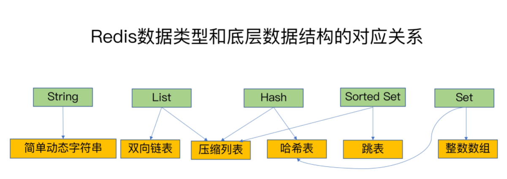
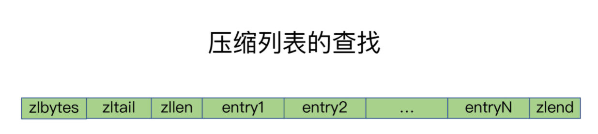
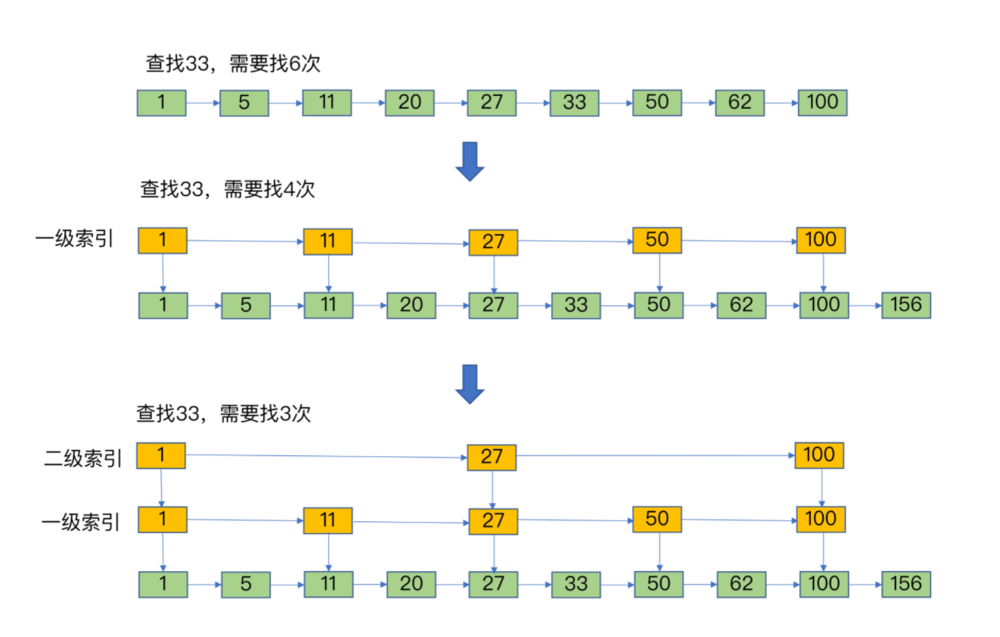

redis 全称 Remote Dictionary Server，即远程字典服务。本文主要介绍 redis 基础知识。    

## redis 单线程理解
首先是单线程，这是 redis 的噱头之一。

在 6.0 版本之前，redis 内部的网络IO和键值对的读写是在同一个线程中完成的。但类似数据持久化、主从同步等，都是多线程完成的。   
所以本质上，redis 并**不是一个绝对的单线程服务。**   

官方之所以这样描述，也只是因为他的核心逻辑都是单线程实现的，然后还能提供很高的并发，这样听上去就有种黑科技的感觉了。    
在 6.0 版本之后，redis 在**网络IO部分引入了多线程**（默认关闭，开启需要配置 io-threads-do-reads yes），而**键值对的读写则还是由单线程完成**。 

## 常见数据类型
redis 常见的数据类型主要有五种：

|数据类型|解释|
|---|---|
|string|字符串。这是 redis 最基础的类型。|
|hash|哈希。包含键值对之间的映射，和全局哈希表同性质。|
|list|列表。简单的字符串列表，可以从左右两边插入和移除。|
|set|集合，这是一个无序的字符串合集|
|zset|有序集合。集合中每个元素都关联着一个评分，这个评分用于把有序集合中的元素按最低分到最高分排列。|

这五种都是 redis 键值对中值的数据类型。他们底层对应着多种存储结构。  
其中包括：**简单动态字符串**、**双向链表**、**整数数组**、***哈希表**、*压缩列表**、**跳表**，他们对应关系如下：

除了 string 之外，其他数据类型都对应着多种存储结构。通常情况下，我们把这四类结构称之为**集合类型**，即一个键对应一个集合。

不同值类型对应不同的存储结构，那键值对本身是如何组织的呢？

在 redis 中，有一个**全局哈希表**，用来存储全部的键值对。      
哈希表的本质就是一个稀疏数组，在这里，我们把每一个元素都称之为一个**哈希桶**。当发生哈希冲突的时候，多个键值会在同一个哈希桶中**拉出一个链表**。
此时每一个链表的节点，就存储着我们的键值信息，我们称之为 `Entry` 结构体（该结构体由 `*key`、`*value`、`*next` 组成）。

在这些底层数据结构中，双向链表和数组是O(N)查找，哈希表是O(1)，还剩下压缩列表和跳表，这是两种平常接触比较少的结构。

#### 压缩列表
压缩列表本质上也是数组，但和数组不同的是，在头部和尾部存储着压缩列表的信息。查找时可以快速定位查找首部和尾部元素。   

#### 跳表
跳表本质上是有序链表，但和链表不同的是，增加了多级索引。     
这里索引的本质，也是一个链表，不过相对于原始链表，索引节点之间的隔了一个至多个原始节点。所以有更快的查找速度。    

## 其他数据类型
还有其余类型：
* bitmap
* hyperloglog
* geo