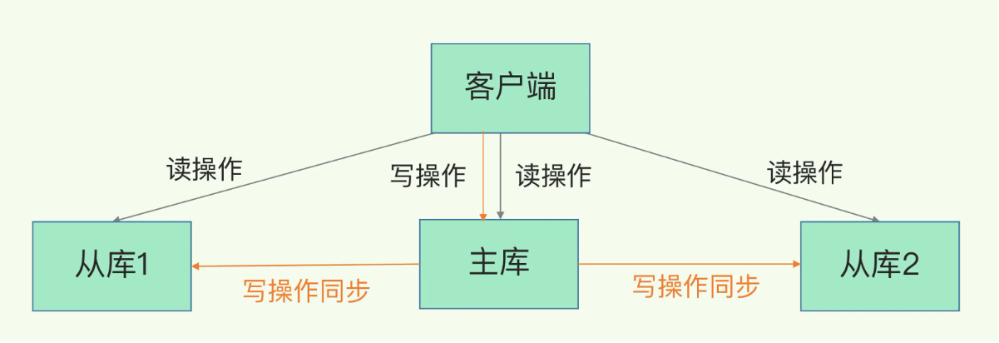
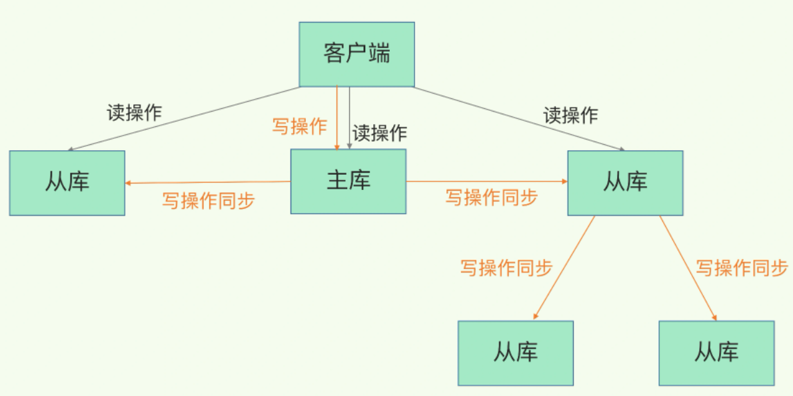

redis 作为主流的内存数据库，除了支持高性能读写外，还保障了服务的高可靠。这里的高可靠大致包含两个目标：    
1、保障数据尽量不丢失。     
2、保障服务尽量少中断。     

针对第一个高可靠目标，我们可以通过 AOF 日志和 RDB 文件快照等持久化机制实现。     
针对第二个高可靠目标，最常见的解决方案就是多副本冗余。即将一份数据同时保存在多个 redis 实例中。
这样即使某个实例异常，另一个冗余实例也可以快速提供服务。

多副本机制的核心点，就是数据的同步机制。   
本文主要介绍 redis 中的主从同步机制。

## 主从同步 - 读写分离
redis 提供了主从同步机制用于保障主从节点之间的数据一致性。而且主从库之间采用的是**读写分离**的方式，也就是说在处理读操作和写操作时是有区别的：
* 读操作：主库、从库均可执行。 
* 写操作：只能在主库执行，否则会产生歧义。主库接受写操作后，再同步给从节点。     



## 主从同步 - 首次同步
在 redis 中实现主从机制比较简单，仅需要启动时配置 `replicaof` 指定主库即可：
```text
replicaof localhost 6379
```
主从关系建立后，会按照三个阶段实现完成数据的第一次同步。

#### 1、第一阶段
从库和指定主库建立连接，并发送 **psync** 指令给主库。该指令包含了 runID 和 offet 两个参数。（第一次建立连接时发送`runID=? offset=-1`）
* runID：这是 redis 启动时随机生成的唯一 ID，此处用于记录主库 ID。
* offset：记录数据同步偏移。第一次同步为 -1，表示需要全量同步。

#### 2、第二阶段
主库接收到 **psync** 指令后，知道从库第一次连接，会立即响应 `FULLRESYNC` 指令。接着，主库执行 bgsave 生成全量快照，再将快照文件同步给从库。  
   
从库在同步数据前，为了避免既有的内存数据造成冲突，会先清空自身内存，然后再接收数据，最后将其加载进内存。

#### 3、第三阶段
在主从同步期间，主库是非阻塞的，可以正常接受写请求。    
为了保证主从数据一致性，在主从同步期间，所有的写操作，会被记录到 `replication buffer` 中。   
所以在快照文件同步完成后，最后再将 `replication buffer` 中的写操作同步给从库，至此第一次同步完成。


## 主从同步 - 联级模式
第一次主库同步时，主库需要生成全量快照文件，并传输给从库。      
这其实是一个比较消耗资源的过程，特别是当从库的数据较多时，会对主库造成较大的负担。    

为了解决这类问题，redis 支持 "主-从-从" 的联级模式。      
在该模式下，从库不在直连主库，而是选择某个从库作为主库，这样本来对主库的压力，就可以分散到从库上。




## 主从同步 - 增量同步
主从库第一次建立连接时，会发起全量同步，之后则是增量同步。    
但是如果因为网络等原因，导致主从库之间断开了连接，这时候主从库之间就会出现数据不一致的问题。为此，redis 支持重连后的增量同步机制。

但不是所有的版本都支持断连后的增量同步：    
在 redis 2.8 之前，主库和从库发生断连后，从库会重新申请进行一次全量复制。     
在 redis 2.8 之后，支持断连后的增量同步机制。   

断连后的增量同步技术，核心其实是一个叫 `repl_backlog_buffer` 的**环形缓冲区**。在该缓冲区中，**主库记录写入的位置，从库记录读取的位置。**

当主从断连后，主库会将接收到的写操作，记录到 `repl_backlog_buffer` 环形缓冲区中，并记录写入的位置，此时从库记录的位置则不变。    
那么当连接恢复后，主库依据从库发送过来的 offset，就可以知道从库此时需要接收那些更新操作了。   

但是如果失连时间过久，或者写入压力很大，导致环形缓冲区被覆盖了，这时从库则不得不重新进行全量复制。


