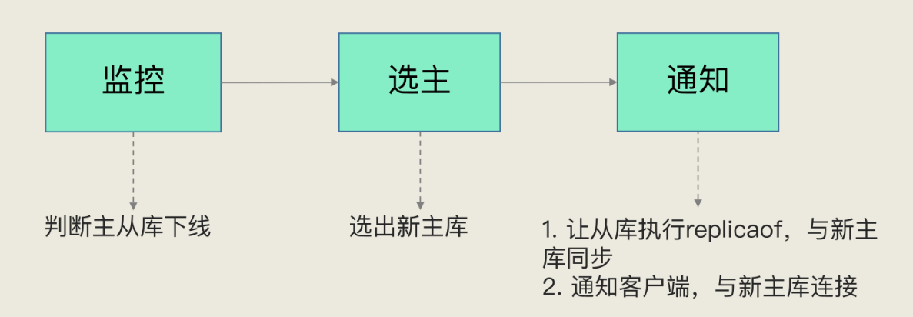

redis 支持主备多副本模式，用于解决单点故障问题。当主库发生故障时，从库可以转正，继续提供服务。
但是 redis 只依靠主备节点服务，是没有办法实现高可用，还依赖与哨兵服务。    
本文主要介绍 redis 基于哨兵机制，实现高可用。

## 哨兵机制
哨兵本质是一个运行在特殊模式下的 redis 进程。它的主要作用就是：**监控、选主、通知。**

一个完整的 redis 高可用集群，包含主库、备库、哨兵三类实例。    
当主库异常宕机后，哨兵会及时监控并发现异常，然后将备库升级为主库，从而继续提供服务。

#### 哨兵机制 - 监控
监控是指哨兵周期性的对所有主从实例发送 PING 指令，检测他们是否存活。   
如果从库没有在指定时间内响应请求，哨兵则将其标记未下线状态。

#### 哨兵机制 - 选主

#### 哨兵机制 - 通知

## 哨兵集群

