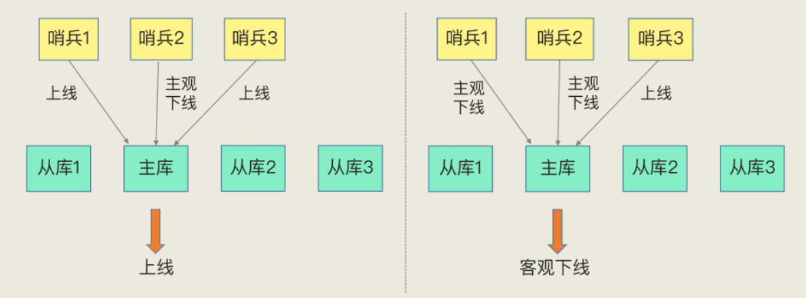
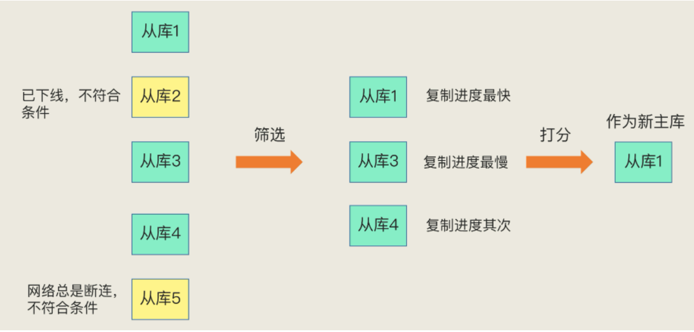

redis 支持主备多副本模式，用于解决单点故障问题。当主库发生故障时，从库可以转正，继续提供服务。    
但是 redis 只依靠主备节点服务，是没有办法实现高可用，还依赖于哨兵服务。    
本文主要介绍 redis 哨兵机制实现高可用。

## 哨兵机制
哨兵本质是一个运行在特殊模式下的 redis 进程。它的主要作用就是：**监控、选主、通知。**
 
具体来说，一个 redis 高可用集群，应该包含主库、备库、哨兵三类实例。   
哨兵监控主从库之间的状态，以便及时发现异常。    
当异常发生时，哨兵需要确定是那个节点发生了异常，然后执行对应的处理。    
如果是从节点发生异常，可能仅需要标记下线即可。   
如果是主节点发生异常，这时就需要选择一个从库升级为主库。    
最后通知用户，主库发生了切换。

#### 哨兵机制 - 监控
监控是指哨兵周期性的对所有主从实例发送 PING 指令，检测他们是否存活。   
如果从库没有在指定时间内响应请求，哨兵则将其标记未下线状态。  
如果主库没有在指定时间内响应请求，哨兵会经过**决策判定**，确认主库下线，然后执行**选主**。

针对从库做判定时比较简单，一般都是主观下线就可以。    
但判定主库时则需要谨慎，因为主库下线则需要进行选主，这会是一个比较消耗资源的过程。   
为了避免单个哨兵误判，一般会有两种判定：    
* 主观下线：单个哨兵确定节点下线。
* 客观下线：多个哨兵确定节点下线，一般需要一半以上的哨兵，即 N/2 + 1 个。

所以一般采用多个哨兵来组成哨兵集群。由他们一起做决策，误判率也能降低。

#### 哨兵机制 - 选主
选主是哨兵确认主库客观下线后，再从多个从库中，按照一定的条件选出新的主库的过程。   
选择过程可以简单分为：**筛选 + 打分**。

##### 筛选
筛选的过程，就是初步过滤掉不合适的从库。包括：    
1、已下线的从库    
2、down-after-milliseconds 过大的从库。这个指标表示主从断连的最大连接超时时间，越大则表示网络越不稳定。   

##### 打分
打分的过程，就是选择出最合适的从库。分别按以下优先级选择：    
1、从库优先级。slave_priority 越大则优先级越高，0 则表示不会升级为主库。     
2、从库复制进度。master_repl_offset 记录主库当前写操作。slave_repl_offset 记录从库获取更新的位置。二者越近则优先级越高。    
3、从库ID号。这时主从初始化时设置的编号，编号越小优先级越高。     

#### 哨兵机制 - 通知
通知的过程，就是通过 pub/sub 机制，将新主库的地址发送出去，客户端订阅该频道即可获取最新主库地址。
