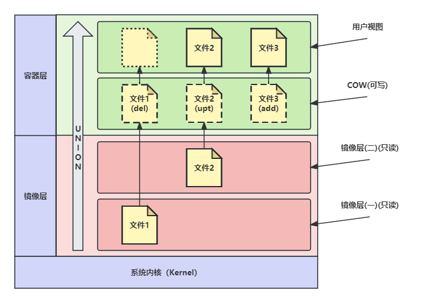

## 什么是镜像？
在 Docker 中，镜像（Image）是构建和运行容器的基础。

我们可以把镜像理解为一个**只读的模板**，它包含了运行一个应用程序所需的所有内容：
- 应用程序
- 运行时环境
- 系统工具
- 库文件
- 配置参数
- ...

简单来说，镜像就是一个用于创建容器的快照，它是一个独立且完整的应用程序包。

## 镜像组成
镜像由一系列层（Layers）组成，每个层都代表着镜像的一部分。

每个层都是只读的，并且在构建镜像时是按照顺序添加的。

这种分层的结构使得镜像在构建和分发时更加高效，因为相同的层可以被多个镜像共享，从而节省存储空间。

## 关键技术

Docker 镜像关键技术有：
- UnionFS（联合文件系统）
- Copy-On-Write（写时复制）
- Layers（分层存储）

### UnionFS(联合文件系统)

UnionFS 是一种文件系统技术，它允许将多个不同位置的文件系统（通常是只读文件系统）联合挂载成为一个单一的文件系统。
Docker 使用联合文件系统来构建镜像，并通过分层的方式实现镜像的高效复用和存储。

因此，不同镜像之间可以共享相同的文件，节省存储空间。
这样的设计使得多个容器可以在相同的宿主机上运行，而只需使用少量额外的磁盘空间。
从而实现高效的资源利用。

:::note
主要使用的联合文件系统包括 AUFS（Advanced Multi-Layered Unification Filesystem）、
OverlayFS 和 overlay2。
:::

### Copy-On-Write(写时复制)

Copy-On-Write 是一种优化技术，
它主要用于在多个资源（通常是内存或存储）共享时减少复制和资源冗余，从而提高性能和节省资源。

在 Docker 中，COW 技术主要应用于容器的文件系统。当创建一个容器时，它会使用基础镜像的只读副本作为根文件系统，
并在其上创建一个可写层，用于保存容器运行时所做的更改。这样，当容器启动时，
它实际上是在只读的基础镜像上运行，而所有对文件的修改都会被写入可写层，保持原始镜像不受影响。

其核心流程包括：

- **容器文件系统的初始化**： 当创建一个新的容器时，Docker 会为该容器选择一个基础镜像作为其只读文件系统的根。
这个基础镜像包含了应用程序和依赖的基本文件。

- **可写层的创建**： 在容器的基础镜像之上，Docker 创建一个可写的文件系统层，也称为容器层。
这个层用于保存容器运行时的所有更改。

- **文件系统操作**： 当容器启动时，Docker 将其可写层与基础镜像的只读层（或其他层）联合挂载成一个单一的文件系统视图。
这使得在容器内部可以同时看到基础镜像的内容和可写层的内容。

- **写操作处理**： 当容器内部的进程尝试对某个文件进行写操作时，写操作会首先被发送到可写层，
而不是基础镜像的只读层。如果在可写层中已经存在该文件的副本，就会在可写层上执行写操作。
但是，如果在可写层中没有该文件的副本，Docker 会执行 COW 技术：它会在可写层中创建该文件的副本，
并在该副本上执行写操作，保持基础镜像的只读层不受影响。

- **资源共享**： 多个容器可以使用同一个基础镜像，但每个容器都有自己的可写层，它们之间的文件系统更改互不干扰。
这使得多个容器可以在同一个基础镜像上运行，共享文件系统的只读部分，从而节省存储空间和内存。

- **生命周期**： 容器在运行过程中可以随时对文件进行读写操作，而这些更改都会存储在其对应的可写层上。
当容器被删除时，可写层也会被删除，保持基础镜像的只读层的完整性。

### Layers(分层存储)

Docker 镜像采用分层存储的方式，这是一种将文件系统组织成一系列分层的方法。

在镜像层中，每个层级都是一个只读的文件系统，不同层级文件通过 UnionFS 联合挂载为一个单一的文件系统来提供服务。

而在容器层中，基于镜像层的基础之上，通过叠加一个或多个（Copy-On-Write 写时复制技术）可写层在其上进行运行。
这样多个容器之间即使依赖同一个基础镜像层，也能确保容器之间互不影响，独立性与隔离性也就得到了保障。

这种设计允许不同镜像共享相同的基础层，节省存储空间，并提高镜像的构建、下载和推送速度。

:::info 总结

镜像是Docker中用于构建和运行容器的模板，它是一个只读且不可变的快照。镜像由多个分层构成，可以来自Docker
Hub、私有仓库或本地构建。使用Dockerfile定义镜像的构建过程，通过标签管理不同版本的镜像。通过镜像可以创建多个相同或不同配置的容器，容器是镜像的运行实例。

:::
